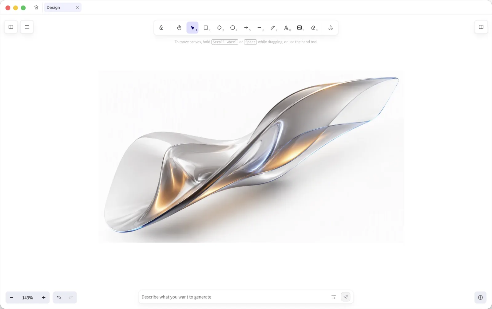

<div align="center">
  
  <h1>CoreStudio</h1>
  <p><strong>A local-first canvas for image generation</strong></p>
  <p><strong>English</strong> · <a href="README.zh-CN.md">简体中文</a></p>
  <p>
    <a href="https://getcorestudio.com/"><strong>Official website</strong></a>
    ·
    <a href="https://getcorestudio.com/zh/">Chinese website</a>
    ·
    <a href="https://github.com/walnut-a/CoreStudio/releases/latest">Download for macOS</a>
    ·
    <a href="docs/README.md">Documentation</a>
  </p>
  <p>
    <a href="https://github.com/walnut-a/CoreStudio/releases/latest"></a>
    <a href="https://github.com/walnut-a/CoreStudio/actions/workflows/corestudio-desktop.yml"></a>
    <a href="LICENSE"></a>
  </p>
</div>

CoreStudio adds image generation, local asset management, and agent collaboration to the excellent Excalidraw project. Projects, assets, and generated results stay on your device by default. You can configure the models you need, or let agents such as Codex bind to their own local projects, work independently of desktop tabs, and write results back through the CLI and Local Bridge. CoreStudio is free, open source, and fully customizable.

<p align="center">
  <a href="https://getcorestudio.com/">
    
  </a>
</p>

## Why CoreStudio

- **Local-first:** Projects, assets, and generated results stay local, making them easy to inspect, organize, back up, and move.
- **A proven canvas:** CoreStudio inherits Excalidraw's shapes, text, connectors, diagrams, and freeform layout instead of reinventing the canvas.
- **Model freedom:** Configure your preferred image-generation services and keep working with reference images, prompts, and generation history on the canvas.
- **Built for agents:** CoreStudio CLI and Local Bridge give every Agent task an explicit project binding, so browser context and human desktop tabs never become file-write paths.
- **Free and open source:** CoreStudio is free to use, released under the MIT License, and ready to adapt to your own workflow.

## Download

Current public releases target macOS. Download the latest version from [GitHub Releases](https://github.com/walnut-a/CoreStudio/releases/latest).

CoreStudio itself does not charge additional usage fees. Third-party model APIs and agent products remain subject to their own subscription, usage, and quota policies.

## Project and repository

The main product code lives in `excalidraw/apps/image-board-desktop/`. The `excalidraw/` directory retains the upstream Excalidraw monorepo structure, with the CoreStudio desktop client maintained as the `image-board-desktop` workspace. The `website/` directory contains the static official website deployed through GitHub Pages.

Upstream Excalidraw is released under the MIT License, and so is this repository. See [LICENSE](LICENSE) and [excalidraw/LICENSE](excalidraw/LICENSE).

## Repository layout

```text
.
├── README.md
├── README.zh-CN.md
├── LICENSE
├── docs/
│   ├── README.md
│   ├── doc/
│   ├── plan/
│   ├── spec/
│   └── superpowers/
├── excalidraw/
│   ├── apps/image-board-desktop/
│   ├── packages/
│   ├── excalidraw-app/
│   └── package.json
├── website/
│   ├── index.html
│   ├── zh/
│   └── assets/
└── review-packets/
```

| Path                                              | Purpose                                                                                 |
| ------------------------------------------------- | --------------------------------------------------------------------------------------- |
| `docs/README.md`                                  | Main entry point for repository documentation                                           |
| `docs/doc/`                                       | Stable documentation such as repository analysis, architecture, and interface guides    |
| `docs/plan/`                                      | Entry point for future plans; no new plan is created there by default                   |
| `docs/spec/`                                      | Entry point for future specifications; no new specification is created there by default |
| `docs/superpowers/`                               | Existing historical plans and specifications, preserved in their current location       |
| `excalidraw/`                                     | Upstream Excalidraw monorepo and the active CoreStudio workspace                        |
| `excalidraw/apps/image-board-desktop/`            | Main CoreStudio desktop application                                                     |
| `excalidraw/apps/image-board-desktop/electron/`   | Electron main process, project files, Local Bridge, and provider adapters               |
| `excalidraw/apps/image-board-desktop/src/app/`    | React renderer, canvas UI, generation composer, generation history, and project state   |
| `excalidraw/apps/image-board-desktop/src/shared/` | Shared renderer/Electron types and data-integrity logic                                 |
| `excalidraw/packages/`                            | Excalidraw workspace packages                                                           |
| `website/`                                        | Static website pages, responsive assets, and GitHub Pages configuration                 |
| `review-packets/`                                 | Local review material; not a primary source-code entry point                            |

## Core capabilities

The following capabilities are backed by current code or documentation:

- Excalidraw canvas features including shapes, text, images, grouping, and freeform composition.
- Local project-folder persistence for `project.json`, `scene.excalidraw.json`, `image-records.json`, `assets/`, and related data.
- Multiple image-generation providers, including Gemini, ZenMux, fal.ai, Jimeng / Seedream, OpenAI, and OpenRouter.
- A bottom generation composer with reference images, generation parameters, prompt library, and generation history.
- An image-details sidebar with generation parameters, error details, and result location.
- Agent Board, a local web canvas entry point.
- CoreStudio CLI at `excalidraw/apps/image-board-desktop/bin/corestudio.cjs`.
- Local Bridge for local project access from Agent Board and the CLI.
- Codex agent workflows for canvas reads, selection context, controlled writeback, and result location.
- Project health checks and repair flows covering asset, canvas-element, and generation-record consistency.
- macOS packaging, notarization, release, and secret-scanning workflows.

## Entry points

| Entry point         | Source                                                                 | Description                                                                       |
| ------------------- | ---------------------------------------------------------------------- | --------------------------------------------------------------------------------- |
| Official website    | `website/`                                                             | [getcorestudio.com](https://getcorestudio.com/)                                   |
| Desktop development | `excalidraw/package.json` -> `dev:desktop`                             | Starts CoreStudio Dev with the project-specific Electron path, profile, and ports |
| Desktop build       | `excalidraw/package.json` -> `build:desktop`                           | Builds the renderer and Electron main/preload processes                           |
| Desktop packaging   | `excalidraw/package.json` -> `package:desktop`                         | Runs the build, secret scan, electron-builder, and notarization                   |
| CLI                 | `excalidraw/apps/image-board-desktop/package.json` -> `bin.corestudio` | Calls the local bridge through `node bin/corestudio.cjs ...`                      |
| Agent Board         | `/agent-board` in `electron/main.ts` and `AgentBoard.tsx`              | Requires the local client and Local Bridge                                        |
| React renderer      | `excalidraw/apps/image-board-desktop/src/main.tsx`                     | CoreStudio desktop frontend entry point                                           |
| Electron main       | `excalidraw/apps/image-board-desktop/electron/main.ts`                 | Desktop main-process entry point                                                  |

## Common commands

Enter the active workspace:

```sh
cd excalidraw
```

Install dependencies:

```sh
corepack yarn install
```

Start the desktop client in development mode:

```sh
corepack yarn dev:desktop
```

`start:desktop` remains available as a compatibility alias. The project launcher pins the Electron process to the absolute `apps/image-board-desktop` path, a dedicated `.electron-dev-profile`, renderer port `5174`, and debugging port `9331`. Startup logs print the application path, Electron executable, user-data directory, and development window title. Do not use a global `electron`, `open -a Electron`, or broad Electron process termination.

The main process rejects bare source launches, manually created `qa` runtimes, and custom development Bridge, profile, or session identities. Real UI acceptance must use the fixed `CoreStudio Dev` identity: run `corepack yarn dev:desktop` for source interaction or `corepack yarn preview:desktop` for packaged-development acceptance. If a development instance is already running, reuse it or close that exact instance before restarting. Do not create a temporary Electron identity. See [AGENTS.md](AGENTS.md) for repository-level rules.

Run common checks:

```sh
corepack yarn test:desktop --run
corepack yarn test:typecheck
corepack yarn check:desktop-secrets --source --package-inputs
```

The root `.github/workflows/corestudio-desktop.yml` workflow runs `test:typecheck`, `test:desktop --run`, and the source secret scan on GitHub.

Package the desktop client:

```sh
corepack yarn package:desktop
```

Generated installers are written to `excalidraw/apps/image-board-desktop/release/`, which is ignored by Git.

## Documentation

Start here:

- [docs/README.md](docs/README.md): Main repository documentation index.
- [docs/doc/repository-analysis.md](docs/doc/repository-analysis.md): Current repository, branch, structure, capability, and maintenance-boundary analysis.
- [docs/doc/excalidraw-fork-maintenance.md](docs/doc/excalidraw-fork-maintenance.md): Excalidraw fork maintenance guide.
- [excalidraw/apps/image-board-desktop/README.md](excalidraw/apps/image-board-desktop/README.md): CoreStudio CLI and Agent Bridge guide.
- [excalidraw/apps/image-board-desktop/PRODUCT.md](excalidraw/apps/image-board-desktop/PRODUCT.md): Product positioning and agent-integration principles.
- [excalidraw/apps/image-board-desktop/DESIGN.md](excalidraw/apps/image-board-desktop/DESIGN.md): Design system and interface constraints.
- [excalidraw/apps/image-board-desktop/RELEASE.md](excalidraw/apps/image-board-desktop/RELEASE.md): Packaging, notarization, release, and secret-scanning process.

Agent-integration details live in `excalidraw/apps/image-board-desktop/docs/`, including:

- `agent-integration-user-guide.md`: User-facing guide.
- `agent-cli-contract.md`: CLI contract and examples.
- `agent-integration-architecture-and-principles.md`: Architecture and iteration principles.

## Documentation update policy

- Small changes should update the relevant document under `docs/doc/` or the feature directory.
- Major feature, positioning, entry-point, capability, or branch-baseline changes must also update this README.
- When adding, deleting, or moving documentation, update the corresponding README index.
- Repository paths must remain relative. Do not include local absolute paths, temporary paths, or agent runtime paths.
- The repository retains an entry point for plans, but agents do not create new plan documents there by default.
- The repository retains an entry point for specifications, but agents do not create new specification documents there by default.

## Guide for future agents

1. Read this README first, then [docs/README.md](docs/README.md).
2. Reconfirm the current code-reading baseline with `git branch --all`, `git remote -v`, and the remote HEAD. Do not infer it from an old document.
3. Read [docs/doc/repository-analysis.md](docs/doc/repository-analysis.md) when you need the current repository structure and capability map.
4. Start in `excalidraw/apps/image-board-desktop/docs/` for Agent Board, CLI, and Codex integration details.
5. Mark uncertain information as unconfirmed instead of inferring it from branch names or stale documentation.
6. The active product code primarily lives in `excalidraw/apps/image-board-desktop/`.

## Security

CoreStudio model-service keys remain local: they are not committed to source control or included in installers. To avoid system-keychain authorization prompts, the current version stores keys with a `plain:` prefix in `image-board-settings.json` under the local app-data directory and restricts the file to the current user. The desktop client includes `check-secrets` scripts that scan source, packaging inputs, and release outputs for common API keys, bearer tokens, and local configuration files.

Before packaging, run at least:

```sh
cd excalidraw
corepack yarn check:desktop-secrets --source --package-inputs
```

After packaging, run:

```sh
cd excalidraw/apps/image-board-desktop
corepack yarn check:secrets --release
```
