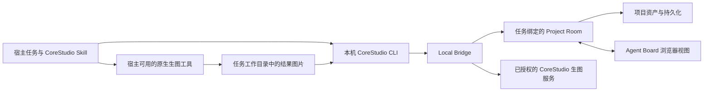

# WorkBuddy、千问办公、豆包工作接入 CoreStudio 调研

> 调研日期：2026-09-06  
> CoreStudio 基线：`6457e1115`，客户端 1.1.49，Agent integration 2.1.2 / Skill 21 / CLI wrapper 2 / Bridge protocol 7。  
> 状态：完成公开资料、现有代码及部分本机证据核对；不是三款宿主的接入验收或实现承诺。  
> 本文中的“官方支持”指 CoreStudio 维护、测试并提供安装与使用入口，不代表腾讯、阿里或字节已认证合作。

## 1. 结论

三款产品均有接入价值。建议按 **WorkBuddy → 千问办公 → 豆包工作** 的顺序推进，先以本机 macOS 桌面任务为范围，沿用 `Skill → CLI → Local Bridge → Project Room`。

浏览器能力不是充分条件。必须同时验证：技能实际加载、宿主能执行本机 CLI、命令与浏览器能访问同一个本机 CoreStudio、不同任务独立保持 session、生成结果能以真实文件回传。云端浏览器中的 localhost 指向云端，不能直接连接用户电脑。

现阶段不建议为三款产品统一重建 MCP、远程服务或 Agent 调度层。WorkBuddy 和千问办公有较明确的本地扩展路径；豆包工作公开的开发者契约不足，先做能力验证，再决定是否需要本地 MCP 适配。没有原生生图工具不影响浏览、参考图读取和结果写回；可以在用户授权后使用现有 CoreStudio 图片生成服务。

**调研发现的共同前置缺口（后续修复已完成，见第 6.2 节）：Agent 的参考图通道读取原始资产，没有复用客户端的裁切导出修复。** 新宿主上线前应补齐基于画布元素的参考图物化能力，并同时覆盖已有宿主；否则用户在画布裁切后交给 Agent 生图，仍可能把隐藏区域传给模型。详见第 6 节。

## 2. 证据与范围

证据分为三类：

- **官方公开资料**：产品网站、帮助中心、开发者规范。可以确认产品声明与公开接入方式，不能证明特定账号已开通或工具调用已经成功。
- **本机证据**：应用 Info.plist、应用自带的技能说明、只读界面观察。只对列出的版本有效，随应用打包的工具名不视为长期公共 API。
- **待验证项**：账号实际工具、浏览器认领、localhost、输出路径、权限和多任务隔离。未执行的测试明确保留，不用模型家族能力代替产品能力。

本机已安装版本：

| 产品 | 应用 | Bundle ID | 版本 | 本轮观察范围 |
| --- | --- | --- | --- | --- |
| WorkBuddy | WorkBuddy AI.app | `com.workbuddy.workbuddy-ai` | 5.5.2 | 应用元信息、随包技能文档；原有运行实例保持不动 |
| 千问办公中国版 | QwenWorkCN.app | `cn.qwenwork.desktop.mac` | 1.0.1 | 应用元信息、随包指南和技能示例；未启动任务 |
| 豆包工作 | DoubaoWork.app | `com.work.pc.doubao` | 2.25.18 | 官网、应用元信息、未登录界面；点击技能入口出现登录要求，未接受协议或登录 |

本轮没有安装集成、修改宿主配置、调用付费生图、写入项目或发布产品。临时启动的豆包工作已退出，原有 WorkBuddy 实例未清理。不能据此声称端到端接入成功。

## 3. 能力对照

| 能力 | WorkBuddy | 千问办公 | 豆包工作 |
| --- | --- | --- | --- |
| 本地文件操作 | 官方确认 | 官方确认，桌面端 | 官网确认 |
| 本机命令执行 | 官方 Skill Bash / CLI 规范确认 | 官方 Hooks 中 Bash、本地 STDIO 说明提供依据；具体会话 CLI 待测 | 本轮未取得充分官方命令契约；待登录实测 |
| 网页能力 | 官方确认内置网页预览；是否可由 Agent 操作该预览页需测 | 官方浏览器连接器使用 Chrome/Edge 扩展；并非可直接假设为内置浏览器 | 官网确认网页操作；浏览器归属、DOM/nonce 读取待测 |
| Skill 扩展 | 官方包结构、导入和市场 | 官方本地目录、上传、自动触发和斜杠调用 | 官网确认技能；自定义安装契约待验证 |
| MCP | 官方支持，同时有 CLI + Skill 方案 | 官方支持 STDIO、Streamable HTTP、SSE | 公开官方首页不足以确认具体传输与自定义配置；待测 |
| 原生图片生成 | 官方更新日志及随包文生图/编辑工具指南支持 | 官网声明图文生成，随包设计示例使用 ImageGen；实际通用任务工具/模型/参考图能力待测 | 官网明确宣传图片生成与迭代 |
| 访问本机 CoreStudio 与认领 | 未实测 | 未实测 | 未实测 |
| 建议路径 | 先 Skill + 现有 CLI | 先 Skill + 现有 CLI | 先验证同一路径，失败后才评估 MCP |

官方依据：[WorkBuddy 产品介绍](https://www.workbuddy.cn/docs/workbuddy/From-Beginner-to-Expert-Guide/Product-Guide)、[右侧浏览器](https://www.workbuddy.cn/docs/workbuddy/From-Beginner-to-Expert-Guide/Function-Description/Right-Sidebar)、[开放平台连接器](https://open.workbuddy.cn/docs/connector)、[千问办公连接器](https://qwenwork.cn/docs/features/connectors)、[千问办公 Hooks](https://qwenwork.cn/docs/desktop/hooks)、[千问办公官网](https://qwenwork.cn/)、[豆包工作官网](https://www.doubao.com/work)。

### 3.1 WorkBuddy

官方允许本地技能包导入；开放平台给出带 `SKILL.md`、scripts、references 的规范，并说明脚本可以通过 Bash 执行。无需为了接入 CoreStudio，先建设一个远程 MCP 服务。[技能规范](https://open.workbuddy.cn/docs/skill)、[用户技能安装](https://www.workbuddy.cn/docs/workbuddy/From-Beginner-to-Expert-Guide/Function-Description/Skills-Market)

本机 5.5.2 的 `marketplace-skill-installer/SKILL.md` 指向 `$WORKBUDDY_CONFIG_DIR/skills/`，默认位置为 `~/.workbuddy/skills/`。但同包通用 `skill-creator/SKILL.md` 仍写 `.codebuddy/skills`。这是需要实机消歧的文档差异：不能把 CodeBuddy CLI 的路径直接套到 WorkBuddy。首轮使用官方导入入口，验证真实加载位置；确认后再做 CoreStudio 一键安装。`agent_created: true` 在随包创建指南中有要求，须验证它对导入技能和托管更新的作用，不盲目套用到所有分发形式。

WorkBuddy 5.5.2 随包 `miora-creative-core` 指南列出了文生图与图像编辑工具，例如 `mcp__miora__miora_text_to_image`、`mcp__miora__miora_edit_image`；公开日志也记录了图片生成工具。这证明“有相关生成能力”，不证明每种账号/任务都启用相同工具。[官方更新日志](https://www.workbuddy.cn/docs/workbuddy/Changelog)

**CoreStudio 适配要点：**

- 不直接复用 Miora 整套设计技能。其交付规则要求写入 `.miora` 画布，会与用户指定 CoreStudio 的目标冲突；只在当前工具已可用且适合任务时使用其生成能力，最终经 CoreStudio CLI 写回。
- 原生输出必须拿到真实本地图片路径或合法可下载产物，不能把预览卡片、缩略图或网页截图当原始结果。
- 内置网页预览与 Agent 可控浏览器可能不是同一入口。验证 DOM/页面状态、WebSocket、稳定 Board 和多标签页，不凭“能预览网页”宣布已连接。
- Skill + CLI 导入可以先独立交付。连接器市场是后续分发选项，不是第一阶段必需品。

**市场规范的实际冲突：**官方 CLI 连接器要求至少支持 macOS、Linux，并规定安装与认证生命周期；CoreStudio 当前正式交付只覆盖 macOS，Agent session 又是应用进程内短期身份。因此不能把 `agent connect` 冒充跨重启持久登录，也不能申报实际不支持的 Linux。先提供 Skill；若要进入 CLI 连接器市场，向平台确认 macOS-only 例外及无账号本地工具的状态定义，不为满足表单引入不必要 OAuth。[CLI 连接器规范](https://open.workbuddy.cn/docs/connector)

### 3.2 千问办公

调研对象是 **QwenWorkCN 桌面端**，不是普通千问聊天、Qwen Code、钉钉机器人或纯网页云任务。官方桌面指南要求 macOS 14 及以上，因此与 CoreStudio 的 macOS 13 支持范围取交集时，应声明千问办公适配至少 macOS 14。[桌面使用指南](https://qwenwork.cn/docs/getting-started/desktop-workflow)

中国版官方 Skill 目录是 `~/.qwenworkcn/skills/`，支持本地文件导入、自动匹配、`/` 调用。Hooks 页面使用的 `.qwenwork/settings.json` 不应被当成中国版 Skill 路径；实施前还需对照已安装版本确认。[官方技能说明](https://qwenwork.cn/docs/features/skills)

公开浏览器连接器依赖 Chromium 浏览器扩展，明确支持 Chrome/Edge。对 CoreStudio 来说，这要求写一份符合实际浏览器入口的宿主说明；不能照搬 Codex 技能里“只用内置浏览器”的专属工具指令，也不能悄悄替用户安装浏览器扩展。[官方连接器说明](https://qwenwork.cn/docs/features/connectors)

**生图证据需要区分：**官网承诺多模态生成，本机“产品设计”套件的 poster、avatar、board 等示例引用 ImageGen；其中 board 示例也明确按当前会话是否有工具选择模式。因此只能确认产品有相关能力与设计路径，不能确认所有普通任务默认暴露统一图片工具。本机 `media-generation` 技能专门覆盖视频/音乐，不能据此宣称它是图片生成入口。Qwen-Image 模型 API 的存在也不能证明 QwenWork 当前账号已内置它。[产品官网](https://qwenwork.cn/)、[设计工作台](https://qwenwork.cn/docs/workspaces/design)

建议采用 `qwenwork` 宿主 ID、独立 session、CoreStudio 管理的 Skill。没有合适原生图片工具时，按现有权限调用 CoreStudio 生成；不新接百炼账号，不改变用户选择的模型。MCP 虽然可用，本轮 CLI 验证成功就没有必要增加它。

### 3.3 豆包工作

官网明确支持本地文件与网页操作，并宣传 Seedream 5.0 Pro 图片创作和根据反馈修改。因此“豆包工作没有内置生图”这个假设不成立；是否向第三方 Skill 暴露工具、能否取回原图和实际提示词，还需要账号验证。[官方产品页](https://www.doubao.com/work)

本机 2.25.18 未登录。技能入口弹出登录窗口，本轮到此停止，没有通过账号或协议确认继续操作。官网公开页面没有足以固定安装目录、CLI 工具契约、MCP 配置和 localhost 支持的开发文档。

检索中发现旧“豆包桌面版不支持 MCP”的资料，也发现新“豆包工作可配置 STDIO”的个人实测；它们不是同一产品阶段，不能用旧结论否定新版，也不能把社区路径写成官方安装合同。社区线索仅用于下一步在官方客户端找到对应入口，不作为宣布支持的依据。

验证顺序：

1. 登录后的本地电脑任务能否加载 CoreStudio Skill，并运行一个无副作用的本机命令。
2. 能否执行 CoreStudio CLI 与访问本机 Bridge；浏览器是否在同一台 Mac。
3. 能否通过实际页面运行态认领 Board，保持任务隔离。
4. 原生生图能否输出本地原始图片、真实提示词和参考信息。
5. 若没有直接 CLI 工具，再验证官方自定义连接器是否支持本地 STDIO，并测试任务间 session 隔离。

如果只能使用云任务或 GUI 点击，第一阶段不承诺全功能官方支持。不能通过读取私有数据库、监听回复后模拟 MCP、修改客户端或浏览器粘贴，拼出脆弱的正式集成。

## 4. 现有 CoreStudio 可以复用什么

现有架构与合同：[架构原则](../../excalidraw/apps/image-board-desktop/docs/agent-integration-architecture-and-principles.md)、[CLI 契约](../../excalidraw/apps/image-board-desktop/docs/agent-cli-contract.md)、[多宿主方案](../../excalidraw/apps/image-board-desktop/docs/local-agent-multi-host-integration-plan.md)。

可直接复用：稳定 Board、页面认领、session 绑定、Project Room、图片登记、批量布局、生成链、模型权限与生命周期测试。主线目前的宿主白名单只有 `codex`、`cursor`、`claude-code`，新名字不会直接被接受。**仅复制一个 Skill 文件，还不等于完成宿主支持。**

新增连接命令可以沿用现有形状，例如 `agent connect --host workbuddy`，但这是拟议扩展，当前版本不支持。不得为测试冒充 Codex 身份来绕过白名单。

## 5. 非侵入式改动范围

| 层 | 需要调整的文件/模块 | 原则 |
| --- | --- | --- |
| 宿主契约 | `src/shared/agentBridgeTypes.ts`、`agentIntegrationContract.ts` | 增加 host ID、标签和经验证的安装方式；不顺便重写协议 |
| 权限与兼容 | `src/shared/desktopBridgeTypes.ts` 及设置规范化逻辑 | 新宿主独立生图授权，默认不沿用其他宿主权限 |
| 安装与检测 | `electron/agentIntegrationService.ts`、`resources/agent-integration/install.sh` | 继续原子写入、托管 hash、冲突检测；不覆盖用户修改 |
| 宿主指南 | `resources/agent-integration/hosts/` 与公共 Skill | 只替换浏览器入口、安装说明、任务身份与生图选择；不复制三套业务实现 |
| 设置入口 | 现有 `CodexIntegrationSettings.tsx` 等 Agent 集成界面 | 在现有位置增加宿主，不另造常驻状态栏或默认开关 |
| 合同与文档 | `resources/agent-integration/contract.json`、用户指南、官网集成内容 | 安装合同与 Skill 同步升级；具体版本号在实施时确定 |
| 验证 | installer / service / session / policy / Agent integration 测试 | 保持已有三宿主兼容与跨任务隔离 |

这些属于 CoreStudio 自有层，不改 `excalidraw/packages/` 基座，不修改项目文件格式，不把第三方任务日志放进项目。现有 host→固定目录映射只适合可直接安装的宿主；豆包若最终只能走 UI 导入，应扩展有限的安装方式字段，而不是制造不存在的磁盘目录。

## 6. 生图与参考图合同

### 6.1 两条生成路径

**原生路径：**用户选择宿主原生生图，且当前任务有适合的工具 → 获得实际结果文件 → `write image` 一次写回。记录实际传给模型的提示词、有效参考 fileId/elementId；工具未提供最终提示词就保留未知，不能编造。

**CoreStudio 路径：**当前宿主 `read capabilities` 的 supported、authorized、configured 均通过 → 调用现有 `generate image` → 由 CoreStudio 完成记录与持久化。成功后不能再次 `write image`，否则重复入库。

宿主套餐费用与 CoreStudio 配置的模型 API 费用是两条账。原生工具不可用或额度不足时，不静默切换到可能另计费的服务。不能把“文件能写入”当成“用户已经同意调用生图”。

### 6.2 本轮发现的裁切缺口

当前代码事实：

- `electron/agent/readAgentProjectCommand.ts` 的 `scene.imagePaths` 返回 `record.assetPath` 对应的文件路径；没有生成画布可见区域图片。
- `electron/agent/agentImageGenerationService.ts` 以 `rendition: "original"` 读取参考图。`referenceElementIds` 被用于引用信息与布局，不会自动把图像像素裁切。
- `src/app/selectionReference.ts` 的修复是客户端参考图构建路径，不能视为已经修复所有 Agent 路径。

建议在 CoreStudio 自有层提供**按元素物化参考图**的单一能力，并由原生宿主导出与 CoreStudio Agent 生图共用。明确区分“读取原始资产”和“导出用户所见参考图”，保留现有原图读取语义。

实现与验收必须覆盖：裁切坐标对应原图分辨率、旋转/翻转、同一 fileId 对应多个不同裁切元素、多选顺序与布局、临时输出生命周期、失败不回退隐藏原图。只拿 fileId 无法区分同一图片在画布上的多个裁切实例；需以 elementId/明确选区为权威输入。拟议新命令/接口尚未实现，不在安装说明里冒充可用能力。

该问题在调研阶段只记录；用户随后授权先修复，现已在 CoreStudio 自有层完成：`agentReferenceImages.ts` 统一解析元素与来源，复用隔离图片解码器按原图分辨率裁切、翻转、旋转。`generate image` 使用该结果；外部生图通过新增 `read image-paths --visible --element-ids` 取得临时可见图。原图读取保留原义，多个实例必须明确元素，失败不回退原图。

验证：定向回归、类型检查及 SOURCE DEV 真实 CLI 导出；200×200 四色原图分别导出左右 100×200 区域和翻转旋转后的 200×100 图片，逐像素确认隐藏颜色为零。未调用付费模型。临时文件由当前进程管理，正常退出清理。宿主适配仍未开始，应用版本保持 1.1.49；Agent integration 更新为 2.1.3 / Skill 22，以提示既有集成更新使用说明。

## 7. MCP 何时值得做

只有出现以下实测结论才进入 MCP 分支：目标宿主不能稳定执行 CLI，但能运行本地 STDIO MCP，且可以把每次调用归属到明确的任务 session。

届时可评估本地薄适配器，转发既有 CLI/Bridge 业务，不新增项目写入者。Local Bridge 不是 MCP 服务器，不能把它的 HTTP 地址直接填入 MCP 表单期待兼容。

尤其要防止一个宿主复用同一个 MCP 进程，导致所有会话共享一个 CoreStudio session。不要把 MCP 传输连接 ID 当成用户任务 ID；每个逻辑任务显式连接并携带 sessionRef，进程内不保存“最后一次打开的项目”作为默认目标。

现有已确认方案明确不建设 MCP 或云中继。调研可以提出备选；真正实施 MCP 属于改变既定接入范围，需要单独确认。若普通 Skill + CLI 可行，继续保持现有方案。

## 8. 实施顺序与完成标准

### 第一阶段：能力探针，先验证后做产品入口

每个宿主用独立临时工作目录与隔离 CoreStudio 开发项目，不用生产项目。记录宿主版本、OS、账号档位、任务运行位置和已启用工具。按固定入口运行 CoreStudio Dev；不能用生产用户数据验收。

| 探针 | 验证内容 | 通过证据 |
| --- | --- | --- |
| P1 技能 | 导入后新任务实际加载、升级/重启仍可发现 | 工具加载记录及真实界面截图 |
| P2 本机 | 执行 CLI 版本检查，访问同机 Bridge | 命令退出码、身份匹配；不暴露凭证 |
| P3 浏览器 | 打开稳定 Board、读取实际 nonce、认领 | Board 状态、session 绑定及可见截图 |
| P4 多任务 | 两任务绑定不同项目；用户切换/关闭桌面标签 | 数据与选区不串项目，旧 session 失效后不误写 |
| P5 文件闭环 | 读取选中图、回写一张无费用测试图 | 返回 fileId、elementId、operationId、persisted:true，画布可见 |
| P6 原生生图 | 文生图、参考图、原图下载、最终提示词 | 实际工具返回及结果文件；需要相应账号额度 |
| P7 CoreStudio 生图 | 未授权拒绝、授权成功、失败不切模型 | 现有权限合同与持久化结果 |
| P8 恢复 | 宿主续聊/压缩、Bridge 重启、下载未完成、回执丢失 | 不复用他人 session，不重复生成/写回 |
| P9 裁切 | 单图、多实例、翻转旋转、原生及 CoreStudio 两条路径 | 像素级检查排除裁掉区域，不能仅靠截图猜测 |
| P10 安装 | 安装/更新/冲突/卸载、GUI PATH 与目录授权 | 只管理本产品文件，共享 CLI 和其他宿主不受影响 |

前五项应先用合成图片、不调用付费模型。第六、七项是真正的生图验收，不能用 mock 替代。若宿主浏览器不支持稳定认领，先说明缺口，不通过手工拼 nonce、默认桌面项目或截图粘贴绕过。

### 第二阶段：先落地 WorkBuddy 和千问办公

先补齐参考图合同，再增加有限的 host 注册、安装/导入、Skill 和已有设置卡片。优先定向 TDD，随后跑多 session 的纵向集成测试，最后分别在真实宿主完成上表。能跑通后才在官网标记正式支持。

WorkBuddy 官方市场分发单独推进；千问中国版按经验证目录或官方导入渠道交付。初期不需要专家团、Hooks 自动任务、常驻监控或更多开关。

### 第三阶段：豆包工作

先完成登录后的能力探针。若 CLI 路径成立，复用第二阶段；若只能 MCP，形成单独的小范围方案。未确认前，产品与文档只能写“适配调研中”，不能显示绿色“已支持”。

### 工作量判断（估算，不是承诺）

- 三宿主本地连通性与生成能力探针：约 1–2 个工作日，前提是测试账号、登录及额度可用。
- 共同参考图修复 + WorkBuddy/千问宿主扩展、安装、文档和回归：约 3–5 个工作日，取决于浏览器认领与路径差异。
- 豆包 CLI 路径通过后：约 1–2 个工作日补适配；若需要 MCP，另估约 3–5 个工作日并重新评估任务隔离。
- 官方市场审核、平台协商与付费模型质量验证不计入上述开发估算，不承诺三家同时上线。

## 9. 本轮交付与下一步需要的条件

本轮完成的是可据以决策的调研：官方能力、版本证据、非侵入式方案、现有代码缺口和验收门槛已经列明。没有完成三个宿主的端到端操作，不应将“调研完成”写成“适配完成”。

进入实现前，需要豆包工作可用的已登录测试会话，并在三款宿主中确认测试所需的浏览器权限与生图额度。是否新增 MCP、是否扩大到 Linux/Windows、是否申请厂商市场认证，均不属于已经确定的第一阶段范围。

## 10. 来源与复查入口

### 官方公开资料

- [WorkBuddy 开放平台：技能](https://open.workbuddy.cn/docs/skill)：包结构、元信息、脚本调用。
- [WorkBuddy 开放平台：连接器](https://open.workbuddy.cn/docs/connector)：MCP / CLI 路径、分发与平台要求。
- [WorkBuddy 产品介绍](https://www.workbuddy.cn/docs/workbuddy/From-Beginner-to-Expert-Guide/Product-Guide)：本地执行定位。
- [WorkBuddy 右侧栏](https://www.workbuddy.cn/docs/workbuddy/From-Beginner-to-Expert-Guide/Function-Description/Right-Sidebar)：内置网页预览的边界。
- [WorkBuddy 技能安装](https://www.workbuddy.cn/docs/workbuddy/From-Beginner-to-Expert-Guide/Function-Description/Skills-Market)：本地导入及启用。
- [WorkBuddy 更新日志](https://www.workbuddy.cn/docs/workbuddy/Changelog)：图片工具及浏览器相关迭代。
- [千问办公官网](https://qwenwork.cn/)：产品及多模态能力声明。
- [千问办公桌面指南](https://qwenwork.cn/docs/getting-started/desktop-workflow)：本地运行与平台要求。
- [千问办公技能](https://qwenwork.cn/docs/features/skills)：中国版目录与加载方式。
- [千问办公连接器](https://qwenwork.cn/docs/features/connectors)：浏览器扩展与本地 STDIO。
- [千问办公 Hooks](https://qwenwork.cn/docs/desktop/hooks)：Bash 工具及会话事件。
- [千问办公设计工作台](https://qwenwork.cn/docs/workspaces/design)：设计画布不等同于图像生成接口。
- [阿里云千问办公 FAQ](https://www.alibabacloud.com/help/zh/qwenwork/faq/)：桌面、云端能力范围差异。
- [豆包工作官网](https://www.doubao.com/work)：本地操作、技能与图片生成。搜索抓取工具未能正常打开，已使用真实浏览器读取官方页面。

### 本机随包证据（相对各应用 Contents/Resources）

- WorkBuddy：`app.asar.unpacked/resources/plugins/workbuddy-builtin/skills/marketplace-skill-installer/SKILL.md`、`skill-creator/SKILL.md`、`miora-creative-core/SKILL.md`、`miora-image-generation/SKILL.md`。
- QwenWorkCN：`skills/qwenwork-guidance/guide-connectors.md`、`guide-skills.md`、`skills/media-generation/SKILL.md`、`plugins-example/产品设计/skills/poster/SKILL.md`、`avatar/SKILL.md`、`board/SKILL.md`。
- 三款应用 `Contents/Info.plist` 的版本与 Bundle ID。只记录分发版本，不从用户配置、历史会话或凭证中推导能力。

这些随包文件只作为产品能力证据阅读，不将其中面向其自身 Agent 的指令当成 CoreStudio 的实施授权或设计规范。
