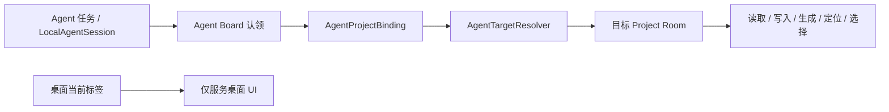

# CoreStudio Agent 项目无感路由优化方案

> 所属项目：CoreStudio Desktop
> 文档类型：需求整理稿
> 状态：可进入技术设计
> 日期：2026-09-04

## 结论

CoreStudio 客户端是否正在运行，是本地 Agent 使用 CoreStudio 的唯一桌面前提。

Agent 不应感知桌面客户端当前激活项目、标签顺序、窗口焦点或用户是否提前打开了目标项目。每个 Agent 任务在认领 Agent Board 后形成独立的目标项目绑定；后续读取、图片写入、生成、定位、选择和图表写入全部通过该绑定进入对应 Project Room。

浏览器只承担 Agent Board 的展示、上下文读取、连接认领和最终可见性验收。Agent 生成或下载的本地文件不得再通过浏览器剪贴板、点击和 `Command + V` 写入画布。

## 需求背景

CoreStudio 已支持多个桌面项目标签，也允许不同 Agent 任务各自连接一个稳定 Agent Board 页面。当前实现已经确认“已认领页面是任务目标，桌面当前标签不是目标身份”，但 CLI 写入仍使用桌面当前项目完成鉴权和路由。

当 Agent Board 连接项目 B，而桌面当前标签停在项目 A 时：

1. 页面能够正确报告项目 B 的 `projectId` 和 Project Room 状态。
2. CLI `read project` 与 `write image` 仍默认落到项目 A。
3. Skill 为避免误写，会停止 CLI 路径并允许 Agent 通过浏览器向页面粘贴图片。

这种兜底避免了写错项目，却引入了新的问题：

- Agent 被迫感知桌面当前标签。
- 浏览器粘贴依赖焦点、坐标、剪贴板和异步 UI 时序，不具备稳定事务语义。
- 批量导入不能可靠返回每张图片的 `fileId`、`elementId` 和持久化结果。
- 画布元素数量变化不足以证明整批文件全部写入。
- Skill 的安全判断替代了底层正确路由，产品架构没有真正闭环。

## 当前事实

- `cliRuntime.ts` 的 `write image` 没有项目或 Board 目标参数。
- `localBridgeServer.ts` 的写入路由先解析 `currentProject`，再寻找该项目的 Agent 参与者状态。
- `stableBoardSessionClaimStore.ts` 已经保存页面与 actor 的认领关系，但没有形成可供 CLI 使用的 actor 到项目绑定。
- `main.ts` 在认领和换取 Board session 时已经能够通过 `stableBoardId` 找到项目并打开对应 Project Room，说明底层具备正确解析目标的基础能力。
- Project Room 已经是 scene 协调、广播和持久化的权威状态，不需要浏览器成为第二条写入通道。

## 产品目标

### 用户心智

用户只需要：

1. 保持 CoreStudio 客户端运行并开启 Agent Bridge。
2. 在 Agent 任务中连接或认领目标 Agent Board。
3. 继续描述任务。

用户不需要切换桌面标签、提前打开项目、核对项目名称，或理解 CLI 的目标选择方式。

### 系统目标

- 一个 Agent 任务在同一时刻只有一个权威目标项目。
- 认领 Agent Board 即建立该任务的目标绑定。
- Agent 的所有项目级 CLI 命令都按绑定路由，不读取桌面当前项目来决定目标。
- 多个 Agent 任务可以同时绑定不同项目，互不影响。
- 桌面标签切换、窗口失焦和标签重排不会改变任何既有 Agent 绑定。
- 目标 Project Room 未加载时由 Bridge 按绑定惰性打开，不要求用户操作桌面 UI。

## 非目标

- 不允许 Agent 直接修改项目文件、scene JSON、图片记录或资产目录。
- 不把任意本地项目路径或 project token 暴露为普通用户需要管理的参数。
- 不让浏览器承担本地文件传输和项目持久化。
- 不建设在线中继、云端项目路由或跨机器写入。
- 第一版不支持一个 Agent 任务同时操作多个目标项目；认领另一个 Board 时应明确替换当前绑定。
- 不因 Agent 连接自动创建、切换或关闭任何用户桌面标签。

## 目标架构



桌面 `currentProject` 不再参与可信 Agent 请求的项目解析。Agent 项目路由的唯一来源是当前 Agent session 已认领的 Board 绑定。

人的项目 renderer 只是 Project Room 的一个可选界面参与者，不是 Agent 写入和持久化的宿主。即使没有任何人用 renderer，Agent writer 也必须能在 Project Room 中完成读取、操作、持久化和回执。

## 核心数据模型

建议新增进程内绑定：

```ts
interface AgentProjectBinding {
  actorId: string;
  stableBoardId: string;
  projectId: string;
  canonicalProjectPath: string;
  roomId: string;
  sessionEpoch: number;
  boundAt: string;
}
```

规则：

- 绑定由 Bridge 在 Board 认领或 session 换取成功后创建，不由 Agent 自行提交项目路径。
- `actorId` 来自可信 `LocalAgentSession`；Codex 兼容身份也必须归一成同一种 actor。
- `stableBoardId` 用于重新发现项目，`projectId` 用于稳定身份校验，`roomId + sessionEpoch` 用于防止旧房间写入。
- `canonicalProjectPath` 只在 CoreStudio 进程内部使用，不写入 Skill、项目文件或可复制连接文本。
- 同一 actor 再次认领其他 Board 时，以新绑定替换旧绑定；替换必须是显式认领的结果，不能由桌面标签变化触发。
- 绑定默认只在当前 CoreStudio 进程内有效。

## 目标解析规则

新增统一的 `AgentTargetResolver`，所有项目级 Agent 命令在进入具体 handler 前先调用它：

1. 从请求中解析并验证可信 Agent 参与者身份。
2. 用 `actorId` 查找当前 `AgentProjectBinding`。
3. 根据 `stableBoardId` 重新发现项目，校验 `projectId` 未变化。
4. 获取或惰性打开目标 Project Room。
5. 校验房间身份与当前 `sessionEpoch`。
6. 返回目标 project 和 room，供读取或写入执行。

禁止规则：

- 可信 Agent 请求没有绑定时，不得回退到桌面 `currentProject`。
- 绑定失效时，不得尝试其他已打开标签或名称相近项目。
- 项目名称只用于展示，不参与目标解析。
- 不通过切换桌面标签来“修复”路由。

对于没有可信 Agent 身份的人工 CLI 调试，可以暂时保留桌面当前项目兼容行为；Agent session 存在时必须始终进入新路由，不能混用两套语义。

## 生命周期

### 首次连接

1. Agent 打开或复用稳定 Agent Board 页面。
2. 页面生成 nonce，Agent 使用可信 session 完成 claim。
3. Bridge 通过 `stableBoardId` 找到项目并打开 Project Room。
4. claim 成功后同时保存 `AgentProjectBinding`。
5. 后续 CLI 命令只携带 Agent session，自动命中该绑定。

### 桌面状态变化

- 切换桌面标签：不更新绑定。
- 关闭目标项目的桌面标签：只关闭人的 renderer 和导航入口，不终止 Agent Project Room，也不弹出 Agent 占用确认。
- 桌面没有当前标签：已绑定 Agent 命令仍正常执行。
- 目标项目从未作为桌面标签打开：Bridge 按稳定 Board 记录惰性打开 Project Room，Home 的 Agent 区域展示该项目，但不创建桌面标签或画布 renderer。

### 客户端重启

进程内 session 和绑定失效。Agent 的下一条项目命令收到明确的重新绑定错误；Skill 应复用原稳定 Board 页面自动重新 claim，不要求用户打开项目或切换标签。重新绑定成功后原命令可以重试一次。

## 桌面可见性与项目列表

> 状态：已确认。

“不依赖桌面当前标签”不应等于“Agent 正在操作的项目在客户端完全不可见”。只要 Agent 已经认领 Board 并建立项目绑定，CoreStudio 应在 Home 中明确显示该项目正在被 Agent 使用，但不得自动创建标签、挂载人的画布 renderer 或抢占焦点。

当前首页列表本质上是“最近项目”历史记录，数量有限，也不保证包含所有可被稳定 Board 解析到的项目。因此不能只给现有最近项目行增加 Agent 状态；否则连接项目恰好不在列表时，用户仍然看不见。

建议把桌面侧项目信息拆成三类：

- `recentProjects`：用户或系统最近使用过的历史导航记录。
- `openProjects`：用户主动打开、已经存在桌面项目标签或 renderer 的项目。
- `agentActiveProjects`：当前至少有一个有效 Agent Board 连接或 agent-writer 操作的项目，来源是权威 binding / room presence。

三类状态保持独立。Home 同时展示 `agentActiveProjects` 与 `recentProjects`，但 Agent 项目不会因此自动进入 `openProjects` 或改写最近项目顺序。

### Home 的“Agent 正在使用”区域

1. Home 在“最近项目”之前提供独立的“Agent 正在使用”区域，直接列出全部 `agentActiveProjects`；项目不在最近列表也必须出现。
2. 每个项目只显示一张协作卡片，包含项目名称、Agent 任务头像或名称、当前状态和 Agent 数量。
3. 首版状态收敛为“正在工作”“已连接”“正在重连”三种；短时 CLI 操作结束后按 presence 租约自动消失，不制造永久在线。
4. 协作卡片提供“打开查看”。用户点击后才创建或激活普通项目标签，并按人的正常打开行为更新最近项目。
5. 项目已经由用户打开时，动作显示为“查看”，只切换到现有标签，不重复创建。
6. 同一项目也在最近项目中时，两个区域可以各自保留入口：上方表达实时 Agent 状态，下方表达历史导航；不得复制成两个桌面标签。
7. Agent 连接或断开只改变 Home 实时区域和已打开画布中的 presence，不改变人的标签集合。

### 人与 Agent 的关闭语义

- 关闭项目标签是人的界面操作，只销毁或隐藏该项目的人用 renderer，不代表关闭项目数据、Project Room 或 Agent session。
- 关闭最后一个人用标签时，即使 Agent 仍在线，也不弹出“Agent 正在使用”二次确认；Agent 继续工作，项目继续显示在 Home 的“Agent 正在使用”区域。
- 人再次从 Home 点击“打开查看”时，重新创建 renderer 并从 Project Room 取得最新 scene，不要求 Agent 重新连接。
- 人的画布存在未提交本地修改时，仍按正常保存规则处理；提示只描述人的未保存内容，不把 Agent 在线状态当成阻止关闭的理由。
- Project Room 的生命周期由 Agent binding、正在执行的 operation 和持久化队列决定，不再由“是否存在桌面标签”决定。
- 只有退出 CoreStudio、关闭 Agent Bridge、删除或移动 Agent 正在使用的项目、显式停止该项目的 Agent 协作等真正会中断任务的动作，才需要警告或阻止。

这组规则取代旧设计中“关闭最后一个本地标签即终止项目房间，并因在线 Agent 弹出二次确认”的约定。实现时应同步修订旧规格、关闭流程测试和用户文案，不能让两套关闭语义并存。

### 为什么不建议只改最近项目

- 最近项目是持久历史，Agent presence 是实时状态，两者生命周期不同。
- 把 claim 强行写成一次“用户打开项目”会污染最近使用顺序。
- 依赖最近项目行承载状态，会让列表上限、记录删除和路径清理意外影响 Agent 可见性。
- 双任务连接两个非最近项目时，独立的 `agentActiveProjects` 仍能完整展示，不需要先制造历史记录。

Home 是 Agent 项目状态的唯一桌面总览；项目标签只表示用户主动打开的画布，两者共享项目身份和 room presence，但不共享打开/关闭生命周期。

## CLI 与 Bridge 契约调整

### CLI 使用方式

标准命令保持简洁：

```bash
corestudio write image <path...> \
  --source-type generated \
  --origin agent-board \
  --json
```

Agent 不需要在每条命令中传 `--project`。CLI 通过当前 `agentSession` 把请求交给 Bridge，Bridge 根据绑定选择目标。

`read project --json` 在可信 Agent session 下应返回绑定项目，并增加可诊断但不泄露凭证的来源字段：

```json
{
  "projectId": "...",
  "name": "...",
  "targetSource": "claimed-board",
  "stableBoardId": "..."
}
```

`read status` 可以继续报告桌面 UI 状态，但必须把它标记为诊断信息；Skill 和项目级命令不得用它确定目标。

### 覆盖范围

以下命令必须统一经过 `AgentTargetResolver`：

- `read project / records / health / board / scene / selection / image-paths`
- `write image / prompt / diagram`
- `edit locate / select`
- `generate image`

只改图片写入会再次形成语义分裂，不可作为完成状态。

### 结构化错误

- `AGENT_TARGET_REQUIRED`：当前 Agent session 尚未认领 Board。
- `AGENT_TARGET_EXPIRED`：客户端重启、session 或绑定已经失效，需要自动重新认领。
- `AGENT_TARGET_PROJECT_UNAVAILABLE`：绑定项目已经移动、删除或不可读取。
- `AGENT_TARGET_ROOM_CHANGED`：目标房间或 session epoch 已变化，旧命令不得继续提交。
- `PROJECT_OPEN_IN_ANOTHER_APP`：目标项目由另一个 CoreStudio 进程持有。

错误必须携带安全的目标身份摘要和恢复动作，不返回 token、项目凭证或用户不需要处理的内部路径。

## 浏览器职责调整

Agent Board 浏览器继续用于：

- 页面认领和连接状态展示。
- WebMCP 读取项目身份、画布摘要和选区。
- 查看写回结果、定位元素和真实视觉验收。

Agent Board 浏览器不再用于：

- 把本地图片编码到浏览器剪贴板。
- 模拟点击、坐标定位和 `Command + V` 导入文件。
- 用图片数量变化代替写入事务验证。
- 在 CLI 路由失败后静默承担写入兜底。

Skill 应明确禁止 Agent 通过浏览器粘贴完成本地文件写回。绑定失败时先恢复绑定；恢复失败则报告结构化错误，不更换数据通道。

## 写入完成标准

同一轮多图片必须使用一条 CLI 命令作为一个批次提交。成功结果至少包含：

- 与输入图片数量一致的 `fileIds` 和 `elementIds`。
- 唯一 `operationId`。
- 目标 `roomId`。
- `roomSequence` 与 `persistedSequence`。
- `persisted: true`。

随后通过绑定项目重新读取画布或定位返回的元素 ID，并在原 Agent Board 页面完成可见性验收。任何图片缺失都视为整批未通过，不能仅凭总元素数量增加报告成功。

## 实现影响面

预计涉及：

- `electron/room/stableBoardSessionClaimStore.ts`：认领结果与 actor 绑定生命周期。
- 新增独立的 Agent 项目绑定 store / resolver，避免把路由继续堆进 claim store。
- `electron/agent/localBridgeServer.ts`：项目级请求统一改用绑定目标。
- `electron/agent/cliRuntime.ts`：确保 Agent session 在全部项目级命令中一致传递。
- `electron/main.ts`：绑定创建、项目发现、Project Room 惰性打开和重启恢复 wiring。
- `electron/projectViewRegistry.ts`：只在用户点击“打开查看”时创建或复用人用 renderer，不为 Agent 后台任务自动挂载画布。
- `electron/main.ts` 的项目标签关闭流程：移除 Agent 参与者确认和“关闭标签即关闭房间”的耦合，仅保留人的保存边界。
- `src/app/components/WelcomePane.tsx` 与桌面 bridge 类型：增加独立的 `agentActiveProjects` 区域、实时状态和“打开查看”动作。
- CLI contract、Agent 集成架构、Skill、安装器、版本合同和 packaged smoke。

## 第一版范围

### 包含

- Codex、Cursor 和 Claude Code 的本地可信 Agent session。
- 每个 Agent session 一个活动目标项目。
- claim 后自动建立绑定。
- 全部项目级 CLI 命令统一路由。
- 目标 Project Room 后台惰性打开。
- Home 独立展示“Agent 正在使用”项目，不自动创建人的项目标签。
- 关闭人的项目标签不终止 Agent Project Room，也不触发 Agent 占用确认。
- 客户端重启后的自动重新认领指引。
- 移除 Skill 中的浏览器图片粘贴兜底。

### 不包含

- 一个任务同时操作多个项目。
- 远程 Agent、云端 Bridge 或跨设备项目。
- 浏览器端任意文件上传 API。
- 用户手工维护项目 token 或 Agent target 参数。
- 改变项目文件格式。

## 实施顺序

1. 先写失败测试，固定“桌面 A、任务 B、CLI 必须写 B”的目标行为。
2. 新增 Agent 目标绑定 store 和 resolver。
3. 在 Board claim / exchange 成功后建立绑定。
4. 将所有项目级 Bridge route 迁移到 resolver。
5. 接入后台 Project Room，并让人用 renderer 只在用户点击“打开查看”时按需创建。
6. 更新 CLI contract、Skill 和错误码，删除浏览器写入兜底。
7. 完成双任务双项目真实验收。
8. 同步升级 Agent integration、Skill 和必要的 Bridge protocol 版本，按正式客户端发版链路交付。

## 发版范围与交付门禁

这不是只改桌面源码的补丁，而是一组必须同步交付的 Agent integration 变更。发版批次包含：

- CoreStudio Desktop：绑定 store、target resolver、Project Room 后台路由和结构化错误。
- Local Bridge / CLI：全部项目级命令改用统一目标解析，补齐批次写入与持久化回执。
- Codex、Cursor、Claude Code Skill：删除“项目不一致时切换标签或浏览器粘贴”的旧指引，改为自动 claim、恢复绑定和一次安全重试。
- 集成安装器与设置页：让已安装旧 Skill 的用户能够检测并升级，不能只把新版 Skill 留在源码或应用包里。
- 版本合同与打包资源：同步 integration version；若请求或响应契约不向后兼容，则同步提升 Bridge protocol，并由源码测试与 packaged smoke 校验一致性。
- 用户文档与故障排查：统一说明“只需客户端运行”，桌面当前项目不再是 Agent 前提，关闭人的标签不会中断 Agent，也不再建议用浏览器粘贴作为写回方案。

### 同步发布矩阵

| 交付面 | 必须同步的内容 | 完成证据 |
| --- | --- | --- |
| Local Bridge | 可信 Agent 请求统一经过 `AgentTargetResolver`；Project Room 不依赖人用标签或 renderer；提供 `agentActiveProjects` 实时状态 | 无标签项目可持续读写；Home 状态与 room presence 一致 |
| CLI | 全部项目级命令按 Agent session 的 Board 绑定路由；`read project` 返回 `targetSource: claimed-board`；补齐绑定失效错误和批次持久化回执 | 桌面 A / Agent B、无桌面标签、双任务双项目 CLI 合同测试通过 |
| Codex Skill | 删除 `PROJECT_MISMATCH`、要求切换桌面标签和浏览器粘贴兜底；改为 claim、绑定恢复、CLI 批次写入和原 Board 可见性验收 | 新 Codex 任务只需客户端运行即可完成目标项目写入 |
| Cursor / Claude Code Skill | 与 Codex 共用同一项目路由和关闭语义，只保留各宿主 session 建立差异 | 三套生成 Skill 的通用规则合同测试一致 |
| 集成安装与升级 | 应用包携带新版 CLI 和三套 Skill；设置页能检测旧版本并执行更新或修复；用户修改过的 Skill 仍遵守冲突保护 | 从上一发布版升级后，实际安装文件、manifest、hash 和版本合同一致 |
| 桌面客户端 | Home 增加“Agent 正在使用”；点击后才打开人用标签；关闭标签不再提示 Agent 占用或关闭 Agent 房间 | 开发版和安装包完成无标签协作、打开查看、关闭后继续写入验收 |
| 仓库用户文档 | 同步 CLI contract、Agent 架构原则、多宿主集成计划、用户指南和 `docs/codex-integration.md` | 文档内不存在旧项目目标、旧关闭语义和浏览器写回指引 |
| 官网 Agent 集成中心 | 中英文教程、首次使用、CLI 示例、工作原理和故障排查同步为新语义；WebMCP 返回同一内容源 | 官网内容合同、链接、CLI 示例与中英文页面测试通过 |
| 版本合同 | 必须提升 Agent integration version；若 Bridge 请求、响应或错误合同不兼容则同步提升 protocol；官网内容 revision 跟随更新 | 运行时常量、包内 `contract.json`、安装 manifest、CLI version 与官网兼容信息一致 |

### CLI 文档口径

- 用户前提只有“CoreStudio 客户端正在运行、Agent Bridge 已启用、当前任务已认领目标 Board”。
- 不再把桌面 `currentProject`、已打开标签或项目名称比对写成命令前置条件。
- `read status` 中的桌面当前项目只能作为 UI 诊断信息；所有项目级示例必须通过 Agent session 展示绑定目标。
- 故障排查围绕 `AGENT_TARGET_REQUIRED`、`AGENT_TARGET_EXPIRED`、项目不可用和房间变化，不再提供切换标签或浏览器粘贴的恢复步骤。
- 图片写入示例使用一条 CLI 批量传入全部文件，并检查每个返回 ID 与 `persisted: true`。

### Skill 口径

- Skill 不感知、不检查也不操作 CoreStudio 人用标签。
- Agent 建立 Board claim 后直接使用 CLI；目标失效时复用原稳定 Board 自动重新 claim，并只安全重试一次。
- Skill 不因 Home 是否打开、目标项目是否出现在最近列表或用户是否点击“打开查看”而改变执行路径。
- 浏览器只用于 Board 认领、上下文读取和结果可见性验收，禁止用剪贴板或模拟粘贴传输本地文件。
- Codex、Cursor、Claude Code 的公共规则必须由同一来源生成，不能分别手工维护出不同项目路由语义。

### 官网文档口径

官网 Agent 集成中心必须直接回答以下问题：

1. **使用前要做什么**：安装对应 Skill 与共享 CLI，保持 CoreStudio 运行并启用 Agent Bridge。
2. **如何选择项目**：在任务中连接或认领目标 Agent Board；桌面当前标签不决定 Agent 目标。
3. **客户端里怎么看状态**：Home 的“Agent 正在使用”区域显示所有活动项目，项目不需要先出现在最近列表。
4. **要不要打开项目**：不需要；点击“打开查看”只是人的查看动作，不是 Agent 工作前提。
5. **关闭标签会怎样**：不会断开 Agent；只有退出客户端、关闭 Bridge、删除项目或显式停止协作等动作才会中断。
6. **文件如何写入**：本地文件通过 CLI / Local Bridge 写入 Project Room，不通过网页粘贴。
7. **出错怎么恢复**：按结构化 target 错误重新 claim 或处理项目可用性，不让用户通过切换桌面标签碰运气。

官网、GitHub 文档和打包 Skill 的这些事实必须来自同一份稳定内容源或合同测试；官网不得形成一套独立、滞后的产品说明。

交付门禁按以下顺序执行：

1. **源码门禁**：定向单测、Local Bridge 集成测试、Skill 契约测试和 typecheck 通过。
2. **开发版门禁**：固定 `CoreStudio Dev` 身份完成桌面 A / 任务 B、无活动标签、后台项目、双任务双项目和客户端重启恢复验收。
3. **集成升级门禁**：从旧版集成执行升级，确认三套宿主安装结果、版本提示和实际加载内容一致。
4. **文档门禁**：CLI contract、三套 Skill、仓库用户文档、官网中英文内容和 WebMCP 响应通过一致性检查，旧语义扫描结果为零。
5. **打包门禁**：打包产物内 CLI、Skill、安装器、版本合同一致，packaged smoke 通过。
6. **安装包门禁**：用正式发版候选安装包重复关键多项目写入与可见性验收，确认不依赖开发环境文件。
7. **发布门禁**：客户端版本、integration version 和官网内容 revision 的发布说明同时列出，安装后能够检测旧集成并引导升级；没有完成安装包与官网验证时不得宣称能力已交付。

兼容策略：新版客户端可以识别旧 Skill，但旧 Skill 发起可信 Agent 请求时也必须由 Bridge 强制使用绑定目标，绝不能恢复 `currentProject` 路由；若旧 Skill 尝试浏览器粘贴，产品无法从协议层可靠拦截，因此升级提示和 Skill 发布必须与客户端发布同步完成。

## 验收口径

- [ ] 客户端运行、桌面项目 A 激活、任务连接项目 B 时，CLI 图片只写入 B。
- [ ] 桌面没有当前项目时，已经绑定的任务仍能读写目标项目。
- [ ] Agent claim 前目标项目没有桌面标签时，Bridge 能后台打开对应 Project Room，且不创建桌面标签或完整画布 renderer。
- [ ] Agent 连接一个不在最近项目列表中的项目后，该项目出现在 Home 的“Agent 正在使用”区域，但不改变当前页面和最近项目顺序。
- [ ] 用户点击协作卡片的“打开查看”后，才创建或激活普通项目标签，并能看到 Agent 已写入的最新内容。
- [ ] 关闭 Agent 正在使用项目的人用标签时，不出现 Agent 占用确认，不终止 Agent session 或 Project Room。
- [ ] 关闭最后一个人用标签后，项目仍显示在 Home 的 Agent 区域，Agent 可以继续读写；再次打开时画布与 Project Room 最新状态一致。
- [ ] Agent 断开后只移除实时状态，不关闭用户已经打开的项目标签。
- [ ] 退出客户端、关闭 Bridge、删除项目等真正中断 Agent 的动作仍有明确保护。
- [ ] 两个 Agent 任务分别连接 A、B 并同时写入时，结果严格隔离。
- [ ] 任务执行期间反复切换桌面标签，不改变任何 CLI 读取、选区、生成或写入目标。
- [ ] 未认领 Board 的可信 Agent 命令失败为 `AGENT_TARGET_REQUIRED`，不写桌面当前项目。
- [ ] 客户端重启后可复用原稳定 Board 自动重新绑定，不要求用户打开项目。
- [ ] 一次写入 4 张图片时返回 4 组 ID、一个 operation，并满足 `persisted: true`。
- [ ] 原 Agent Board 能定位并显示全部返回元素。
- [ ] 任务历史中不存在通过浏览器剪贴板和 `Command + V` 导入本地图片的调用。
- [ ] 绑定项目不可用、房间变化和跨进程占用都有明确结构化错误，不发生降级误写。
- [ ] 相关单测、Local Bridge 集成测试、完整桌面测试、typecheck、packaged smoke 和真实双项目 GUI 验收通过。
- [ ] CLI contract、Codex/Cursor/Claude Code Skill、仓库用户文档和官网中英文内容均采用同一项目路由、Home 状态与标签关闭语义。
- [ ] 已发布官网和 WebMCP 不再把切换桌面项目、打开目标标签或浏览器粘贴列为 Agent 工作步骤。
- [ ] 从上一版集成升级后，实际生效的 CLI 与三套 Skill 版本和应用包版本合同一致。

## 风险与控制

- **旧 CLI 兼容风险**：仅在请求带可信 Agent 身份时强制新语义；人工 CLI 的旧行为单独评估和标记。
- **actor 与 Board 绑定漂移**：每次写入重新核对 `stableBoardId + projectId + sessionEpoch`。
- **Project Room 生命周期**：由 Agent binding、operation 和持久化队列统一引用计数；人的 renderer 可以随标签独立销毁和重建。
- **重试造成重复写入**：写入沿用 `operationId` 与事务幂等边界，只有绑定恢复完成且原请求未被房间接受时才能重试。
- **多宿主规则漂移**：通用 target contract 只维护一份，各宿主 Skill 只负责 session 建立和页面控制差异。

## 待确认问题

暂无产品阻塞项。进入技术设计时需要确认两点实现选择，但不得改变上述产品行为：

1. Agent 目标绑定使用独立 store，还是由现有 claim store 发出事件后交给独立 resolver 保存。
2. 人工 CLI 是否继续兼容桌面当前项目，或后续也改为显式项目绑定。
