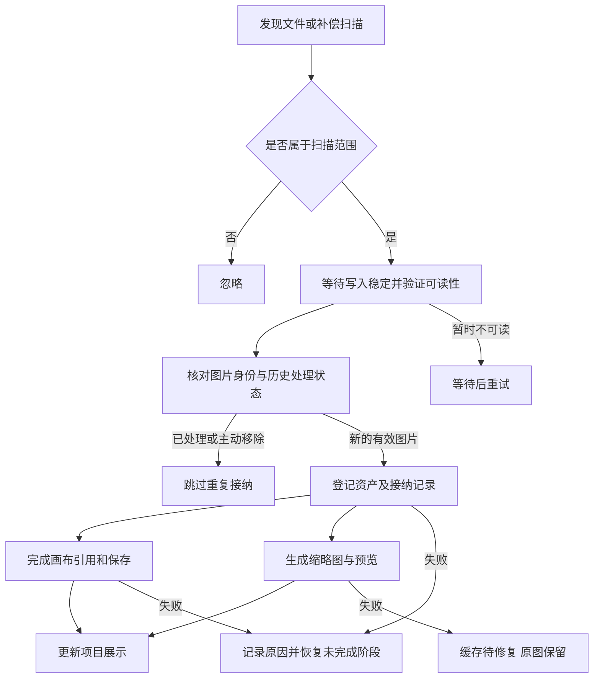

# CoreStudio 外部图片自动接纳与项目维护需求

> 所属项目：CoreStudio Desktop
> 文档类型：已确认需求、实施计划与验收记录
> 状态：Q1–Q6 及静默接纳方向已确认；消融删减与本轮源码验收完成；功能已提交并完成内部包验收，用户已确认可用；正式发布进度见第 18 节
> 日期：2026-09-05
> 交付范围：功能源码与验证；提交、打包安装和发布分别记录

## 1. 需求结论

用户未经 CoreStudio 的导入界面，直接向一个有效的 CoreStudio 项目文件夹新增图片后，软件应自动发现、识别并补齐对应项目数据。正常新增图片不应要求用户重新导入、重启软件或执行项目维护。

项目内可以使用 `inbox/` 整理外部放入的文件，但它只是可选入口。直接放在项目根目录的图片必须得到同等支持，不能要求用户迁移到 `inbox/` 才能被接纳。

自动接纳与项目维护必须采用同一套目录范围、图片身份、处理状态和修复规则。文件是否来自手动复制、下载脚本、同步工具或其他软件，不改变处理行为。

## 2. 背景、问题与当前事实

### 2.1 使用背景

用户可能通过浏览器采集、外部解析服务、云端服务和定时脚本获得图片，最终把图片放入本地项目文件夹。CoreStudio 只需要处理已经到达本地的文件；外部链路由用户自行组织，本需求不要求识别或接入这些服务。

同样的能力也应服务最普通的操作：在文件管理器中复制几张图片到项目目录，随后在 CoreStudio 中自然使用它们。

### 2.2 当前问题

“文件在项目文件夹里”“图片已登记”“画布有对应元素”“缩略图可用”目前不是同一件事。如果只增加文件监听或缩略图生成，仍可能留下无索引、无画布引用、重复导入或被维护功能误报的情况。

### 2.3 源码核查事实

以下为 2026-09-05 对当前工作区的只读核查，描述现状，不作为新能力已经存在的证据：

| 现有能力 | 当前行为 | 对本需求的影响 |
| --- | --- | --- |
| 项目打开 | 读取项目、scene、图片记录，并恢复已有图片写入事务 | 不等于自动接纳任意新增图片 |
| 图片读取 | 通过 `fileId` 查找已有图片记录，再读取资产 | 没有索引的文件不能直接进入正常展示链路 |
| 缩略图与预览 | 可读取缓存、按需生成及执行重建 | 可复用，但不能代替发现和登记 |
| 健康检查 | 扫描 `assets/`，将识别到的未登记资产报告为缺少图片记录，标记需人工处理 | 需要增加“可接纳的新文件”和“真正丢失索引”的区分 |
| 项目修复 | 基于已有图片记录重建缓存，并在符合条件时补回画布元素 | 需要接入新的接纳状态，且继续尊重主动删除 |
| 资产路径 | 当前 `resolveProjectAssetPath` 仅允许 `assets/` 内路径 | 根目录及 `inbox/` 原地引用并非现成能力；存储取舍见第 7 节 |

相关源码与既有规范列在第 15 节。维护修复和自动接纳都不能凭“磁盘上有一张图片”推断用户希望恢复一个已删除的画布元素。

## 3. 已确认内容与规则

### 3.1 用户明确确认

- 统一处理“未经软件，直接向项目文件夹新增图片”的情况。
- 支持可选的 `inbox/`，同时完整支持项目根目录；两种入口不能有能力差异。
- 自动识别、自动处理，并补充所需的项目数据，减少日常手动操作。
- 项目维护的判断标准、修复行为要同步更新，不能与新能力冲突。
- 尽量通过 CoreStudio 自有模块实现，避免对 Excalidraw 底座增加侵入式改动。
- 实施讨论补充确认：普通项目目录的文件就地作为正式原图入库；仅根目录 inbox 子树复制到 assets 后入库，详见第 7.2 节。
- 用户随后授权按本文实现；前置升级独立提交，本功能的实现和验证见第 16 节。

### 3.2 按文档建议确认的规则

用户已确认以下推荐规则作为第一版实现依据：

- 对已加载项目默认启用自动接纳；打开时补扫，加载期间持续检测。
- 普通子文件夹递归纳入范围，内部目录和嵌套项目除外。
- 接纳完成后自动把图片追加到画布空白区域，而非仅存入素材列表。
- 同一项目按内容识别重复文件，避免自动重复放置；主动删除后的抑制状态持久保存。
- 第一版不安装独立常驻服务，不在应用退出后继续处理。

Q1–Q6 均已收口，见第 13 节。

## 4. 目标、范围与非目标

### 4.1 产品目标

1. 用户只需把图片放到项目文件夹，无需了解图片索引、缩略图或 scene 的内部格式。
2. 已接纳图片具有完整、可恢复的项目记录，可正常展示、保存和再次打开。
3. 重复扫描、应用重启和失败重试不会制造重复内容。
4. 正常新增是日常工作流，项目维护用于完整复查和异常处理。
5. 同一项目内的桌面操作、Agent 写入和外部图片接纳可以共存。

### 4.2 第一版包含

- 有效项目中的外部新增图片发现、文件稳定性检查、登记及展示衔接。
- 根目录和可选 `inbox/` 的一致处理。
- 打开补扫、加载期间检测、事件遗漏后的补偿扫描。
- 图片索引、原图关系、缩略图、预览和画布引用的完整性管理。
- 持久化的处理记录、重复识别、失败恢复和主动删除保护。
- 项目健康检查、修复操作、统计与提示文案的统一调整。
- 与现有保存、撤销/重做、项目租约和 Room 生命周期的兼容。

### 4.3 第一版不包含

- 浏览器插件、网页抓取、云端上传下载、定时同步及对应账户配置。
- 对特定外部工具的身份识别、必需的配套元数据文件或服务协议。
- 把普通图片文件夹自动改造成 CoreStudio 项目；目标必须是有效项目。
- 全磁盘搜索、发现未知项目、应用退出后仍运行的导入守护服务。
- 外部覆盖、移动、重命名、删除已有图片的完整双向同步。
- 外部编辑 `project.json`、`image-records.json` 或 scene 的自动合并。
- 为本需求引入新的画布引擎或重写既有项目管理体系。

## 5. 文件发现范围与触发时机

### 5.1 目录规则

| 位置 | 推荐行为 |
| --- | --- |
| 项目根目录的图片 | 自动发现并接纳，核心必需入口 |
| `inbox/` 及其普通子目录 | 与根目录采用相同规则；目录不存在不影响功能，不强制预先创建 |
| 用户创建的普通子文件夹 | 递归扫描，不要求按特定名称组织（Q2 已确认） |
| `assets/` 已登记图片 | 作为正式资产校验，不再次接纳 |
| `assets/` 未登记图片 | 先核对写入事务、历史处理记录及删除状态，再分类为候选新文件或异常资产；不一律自动导入 |
| `cache/`、`exports/`、维护备份、事务与内部工作目录 | 按项目实际目录定义排除整个子树，不把衍生图片再次导入 |
| 含另一个有效 CoreStudio 项目的子目录 | 作为独立项目边界，不递归接纳其中图片 |
| 隐藏、临时、分片和下载中间文件 | 默认不接纳；完成为受支持图片后再处理 |
| 符号链接与项目目录外目标 | 第一版不跟随，避免跨越项目边界或形成递归循环 |

排除目录应来自项目统一定义，自动接纳与维护共用；不能各自维护不同的硬编码清单。普通子目录如果与内部保留目录冲突，应在文档中明确其保留含义。

### 5.2 触发规则

- 项目加载时补扫，覆盖应用未运行或项目未加载期间新增的图片。
- 已加载项目持续检测新增文件和文件写入完成，不依赖当前桌面焦点。
- 项目切换、最小化或应用恢复后应能补偿漏掉的文件事件，不把文件监听事件当作唯一依据。
- 关闭桌面标签是否停止扫描，应按项目自身生命周期决定，不能意外影响仍被 Agent 或其他视图使用的项目。
- 项目真正卸载时释放监听和任务；下次加载从持久化状态恢复。
- Home 页面不改变已加载 Room 的接纳任务；未加载的最近项目不自动扫描（Q4 已确认）。

## 6. 接纳流程与状态

这是业务流程示意，不规定内部模块调用顺序。正式实现必须保证提交边界一致，不能因并行生成缓存导致索引或画布保存状态被误报为成功。

### 6.1 状态口径

| 状态 | 定义 | 用户可见行为 |
| --- | --- | --- |
| 等待文件完成 | 文件正在变化、暂被占用，或尚无法完整读取 | 等待，不立即报损坏 |
| 待接纳 | 有效、稳定且未处理的新图片 | 加入后台队列 |
| 接纳中 | 正在登记或完成画布与持久化 | 后台执行，不显示专门进度 |
| 已接纳 | 项目必需记录及展示引用已持久化 | 可正常使用，重启后保留 |
| 缓存待完成 | 已接纳但缩略图或预览未就绪 | 提供适当占位或受控降级，不阻塞原图与其他图片 |
| 待重试 | 暂时性读取、保存或缓存生成失败 | 有界重试；文件修复后自动恢复，必要时使用已有项目数据修复 |
| 需要处理 | 稳定的损坏文件、权限问题、已有资产内容冲突等 | 在已有项目数据报告中显示原因和适用操作，不无限忙等 |
| 已处理／主动移除 | 已完成过接纳，或用户明确从画布移除 | 不重复添加，不作为自动恢复对象 |

接纳状态与缓存状态应可分别表达。显示“接纳成功”必须有持久化依据；缩略图生成成功不能代替项目保存成功。

### 6.2 文件完整性

- 不把一次文件创建事件或文件扩展名视为写入完成的证明。
- 对大小、修改状态和完整解码等证据做稳定性判断；读取过程中变化的文件重新等待。
- 外部工具无需提供完成标记；能提供临时文件改名时应自然兼容。
- 支持格式首先复用现有安全导入能力。当前 CLI 图片入口列出 PNG、JPEG、WebP、SVG；最终格式清单须与手动导入核对并统一，不承诺新增解码格式。
- SVG 等格式沿用现有验证和资源处理规则，不能因来自本地扫描而绕过。
- 不支持的文件可被跳过并在详情中说明，不中断整批接纳。

## 7. 资产登记、存储与图片身份

### 7.1 必需数据

每次成功接纳至少能追溯：所属项目、源相对路径、内容身份、图片格式和尺寸、对应 `fileId`、正式资产位置、画布引用或明确的未放置状态、处理阶段、失败原因及重试状态。

这些是逻辑信息要求，不意味着必须新增一套重复的图片数据库。已有字段优先复用；扩展数据由 CoreStudio 自有存储负责，不向外部脚本暴露必填内部格式。

本地路径和文件名不能自动推断网页来源、版权、采集时间或生图模型。图片应归类为导入内容，不能误记为 CoreStudio 生成内容。

### 7.2 存储规则（Q1 已确认）

用户于实施讨论中明确：普通项目目录中的图片应当与从画布导入后的正式原图一样，只补齐缺少的数据；inbox 是特殊的收件入口。

| 位置 | 入库方式 | 正式原图与来源关系 |
| --- | --- | --- |
| 项目根目录、普通子目录 | 原文件就地入库；不复制、不移动、不改名，补齐图片记录、画布引用及显示缓存 | 原文件本身就是正式资产，图片记录中的相对 assetPath 直接指向它，不额外建立源文件与资产副本映射 |
| 项目根目录下的 `inbox/` 及其子目录 | 保留 inbox 文件，复制到受管 `assets/` 后登记 | assets 副本是正式原图；接纳状态记录 inbox 来源及内容身份，以避免重复复制和放置 |
| `assets/` 中的文件 | 已登记的不重复接纳；未知文件先按事务和历史依据分类 | 可确认属于外部新增的文件就地登记，不再复制一份 |

只有根目录下的 inbox 子树属于特殊收件入口，普通目录内恰好同名的文件夹不另起一套规则。除存储差异外，两类入口共用验证、去重、保存、画布展示和异常处理能力。就地入库仍需图片记录，记录是资产本身的项目数据，不是额外的外部引用层。

就地入库需要扩展现有资产读取、健康检查、导出及修复边界；仅允许已登记且经过安全校验的项目内相对路径，不放宽到任意文件系统路径。外部覆盖、改名或删除正式原图属于资产异常，不能静默用新内容替代原画布图片。两种入口均不自动删除源文件。

### 7.3 重复与冲突规则（已确认）

- 同一项目、同一内容重复扫描只产生一次自动接纳结果，处理记录必须跨重启保留。
- 根目录、`inbox/` 和子目录使用相同的内容身份规则；同图异名复用已接纳结果，不自动重复放置。此项见 Q5。
- 不同项目独立登记，不能因为其他项目已经处理过就跳过本项目。
- 仅按文件名去重不成立；不同目录中的同名不同内容图片可以是两个候选。
- 已知路径的内容被替换属于“外部变更”，不属于普通新增。第一版不得静默覆盖现有画布图片；应报告并提供重新导入的处理路径。
- 若原图内容在处理期间变化，旧的识别结果不能用于新内容；应重新核对身份。
- 不以“没有缩略图”或“没有画布引用”判断新图片，否则会把既有资产再次导入。

## 8. 画布展示与用户操作

### 8.1 展示方式（Q3 已确认）

接纳成功后，将本批新图片按确定顺序追加到画布空白区域。保留原有元素的位置、大小、分组、选区和视口；不强制跳转到新增内容。

不提供专门接纳面板、成功统计、定位新增批次或扫描按钮。每批按普通网格追加到已有内容右侧空白区，不新建固定分组；正常接纳保持静默，不改变视口。

批次内部的排序应稳定可复核，不能由并行解码完成先后决定。图片尺寸和间距复用现有导入策略，具体布局参数属于实现设计。

### 8.2 删除与撤销

- 用户从画布删除已接纳图片后，源文件和正式资产按既有软删除规则保留。
- 自动扫描和项目维护不得再次把该图片补回画布，包括重启以后。
- 自动追加应能按可理解的批次撤销；撤销同样不能立即触发再次接纳，重做恢复原有操作。
- 用户显式重新导入或恢复图片可以再次放置；该操作与自动扫描去重区分。
- 首次接入旧项目时，如果无法判断缺失引用来自历史删除还是未完成导入，不能批量猜测并恢复，应单独报告待确认项。

## 9. 项目维护同步改造

### 9.1 职责划分

自动接纳负责增量发现和日常恢复；项目维护负责完整复查、汇总异常和重新执行适用修复。两者必须调用同一套分类与修复能力。

“检查”保持只读；它可以报告待接纳文件，但不能在用户执行检查时隐式修改项目。“修复”才执行补全动作。后台自动接纳独立发生时，检查结果应带有检查时点，修复前重新核对当前状态。

### 9.2 统一判断表

| 检查结果 | 新标准 | 维护可执行动作 |
| --- | --- | --- |
| 范围内稳定的新图片，尚未登记 | 待接纳，不直接认定项目损坏 | 交给同一接纳服务补齐 |
| 文件还在写入或暂被占用 | 等待完成 | 重新检查，不强制修复 |
| 有接纳记录但登记／画布提交未完成 | 可恢复的中断任务 | 从已确认阶段续作，不重建第二份图片 |
| 已登记、原图正常、缓存缺失或损坏 | 缓存待修复 | 重建需要的缓存 |
| 画布有引用但索引缺失 | 真正的完整性异常 | 仅在身份与记录依据充分时恢复，否则说明需人工处理 |
| `assets/` 存在未知文件 | 先核对事务与历史；不能全部归为普通新增 | 可确认外部新增的才接纳，归属不明的报告待确认 |
| 图片没有画布引用但存在主动删除／撤销记录 | 正常用户操作 | 不自动补回 |
| 原图缺失、损坏或已被替换 | 真实资产异常 | 报告并提供恢复或重新导入方向，不用缓存掩盖 |
| 缓存、导出、备份内的图片 | 按目录规则排除 | 不作为候选导入 |

### 9.3 维护结果与清理保护

- 分开统计待接纳、处理中、已补全、缓存已修复、跳过和需要人工处理的数量。
- 使用按文件可追溯的原因，不把全部失败统称为“缩略图生成失败”。
- 清理缓存只处理可再生成的缓存，不删除源图片、正式原图或接纳任务状态。
- 维护备份中的图片不得被后续扫描再次导入。
- 有正在执行的接纳任务时，维护应协调或复用任务，不重复写入。
- 沿用既有必要备份和数据保护规则；不能为每张正常新增图片机械生成一次全项目维护备份。

## 10. 可靠性、并发与资源要求

- 同一项目的接纳、手动导入、Agent 写入和维护操作必须通过现有项目协调边界提交，不能各自覆盖 scene 或整份图片索引。
- 不依赖桌面活动标签选择目标；始终使用候选文件所属项目身份。
- 项目关闭或 Room 代次变化后，旧扫描结果不能误写到新项目；已接受事务按现有生命周期约定完成或恢复。
- 项目被其他实例占用、磁盘不可写或项目数据已分叉时，停止相关提交并保留可解释状态，不能绕过租约或覆盖冲突。
- 成功接纳的内容必须跨应用崩溃与重启保持唯一性；原有只在 Room 生命周期内有效的请求回执不能单独满足本需求。
- 扫描、解码与缓存生成使用有界并发，不把批量图片全部读入内存，不在 UI 线程执行重任务。
- 文件监听负责及时发现，补偿扫描负责完整性；批量文件事件应合并处理，避免每个事件都全量扫描。
- 文件一直变化或持续失败时采用有界重试和退避，保留手动重试入口，不进行无限高频重试。
- 日常提示应聚合，不对每张图片弹窗。正常情况无需用户确认每个文件。
- 具体扫描周期、稳定等待窗口、批量吞吐与内存预算在技术设计阶段基于真实样本确定；本稿不虚构时延承诺。

## 11. 非侵入式架构约束

1. 新能力由 `apps/image-board-desktop/` 中 CoreStudio 自有模块承担，监听与接纳队列不下沉到 Excalidraw。
2. 复用现有图片验证、资产写入、Room 协调、缓存和增量画布更新能力，只补充所需接入点。
3. 主入口只负责依赖装配与生命周期连接，避免把扫描、状态恢复和维护规则继续堆入大型入口文件。
4. 自动接纳与项目维护共用分类器、身份判断及修复操作；展示层可以不同，规则不能重复实现。
5. 如需新持久化字段或文件，归属 CoreStudio 项目格式，并明确迁移、备份、未知版本处理及恢复规则。
6. 更新 Excalidraw 时，应能通过独立合同测试验证此能力；如果最终必须修改上游 packages，技术方案应说明现有接入点为何不足。

本需求定义了新的本地文件接纳入口，但不授权外部程序直接编辑项目索引和 scene。既有“Agent 使用 CLI / Local Bridge 写回”的规范仍适用于主动操作项目的 Agent；需在实施文档中补充本地新增文件的产品能力说明，避免旧文档笼统否定这个新入口。

## 12. 验收标准

以下为交付时应执行的验收，不代表当前已经通过。带 Q 编号的场景在对应决策确定后按最终规则验收。

| 编号 | 场景 | 预期结果 |
| --- | --- | --- |
| A01 | 根目录新增一张完整图片 | 自动识别并补齐数据，不要求移入 inbox 或执行维护 |
| A02 | inbox 中新增同类图片 | 与 A01 使用相同的数据和异常规则 |
| A03 | inbox 不存在 | 根目录接纳正常；不要求用户先创建目录 |
| A04 | 软件关闭期间新增图片，再加载项目 | 补扫发现并完成接纳 |
| A05 | 项目已加载时批量复制图片 | 持续处理，原有内容可继续编辑，结果逐步可见 |
| A06 | 文件多次分块写入 | 不接纳半文件；完成后处理一次 |
| A07 | 同一文件触发多次事件、重复扫描及重启 | 图片身份、索引和自动画布放置不重复 |
| A08 | 根目录和 inbox 出现同内容不同文件名 | 按 Q5 去重规则处理并说明跳过原因 |
| A09 | 两个项目收到同一张图片 | 两个项目独立接纳，互不串写 |
| A10 | 相同文件名、不同目录、不同内容 | 不因名称相同覆盖另一张图片 |
| A11 | 已知图片路径被外部覆盖 | 不静默替换画布内容，报告外部变更 |
| A12 | 缩略图生成失败但原图有效 | 原图和已提交记录保留，缓存可独立重试 |
| A13 | 索引／画布保存期间磁盘失败 | 不显示全部成功；恢复后续作，不重复添加 |
| A14 | 在不同提交阶段强制中断，再重启 | 不丢失既有项目数据，未完成项可恢复且结果唯一 |
| A15 | 接纳后在画布删除或撤销，再扫描／维护／重启 | 不自动恢复；显式重做或重新导入仍可用 |
| A16 | 自动接纳、维护修复、手动导入和 Agent 同时发生 | 不重复写入，不覆盖其他操作，不误判新文件为损坏 |
| A17 | 只运行项目健康检查 | 报告待接纳与异常，检查本身不修改文件 |
| A18 | 清理缓存和创建维护备份 | 原图与接纳状态保留，备份及衍生图片不被重新导入 |
| A19 | 深层子目录、内部目录、嵌套项目和符号链接 | 按最终扫描规则执行，不跨越项目边界（Q2） |
| A20 | 切换桌面焦点或 Home，目标 Room 仍加载 | 文件始终进入所属项目，不抢焦点 |
| A21 | 项目真正卸载、关闭或被另一实例占用 | 任务正确释放或等待，旧任务不越权提交 |
| A22 | 升级前就有未登记图片和历史软删除资产 | 前者按可确认身份接纳；后者不被猜测恢复 |
| A23 | 中文、空格及长文件名；只读或暂不可访问目录 | 支持有效路径，失败有原因，不阻断其他可处理文件 |
| A24 | 重新打开、导出及读取接纳后的图片 | 正式图片路径、索引和画布关系一致（Q1、Q3） |
| A25 | 真实批量样本与大项目 | 无随事件数量重复全扫或无限任务增长；记录实际耗时和资源峰值 |

验证分层遵循项目现有规范：先进行分类、状态和恢复的定向测试，再验证真实临时项目的文件发现到持久化链路；涉及窗口内自动出现、视口、撤销和维护提示时必须有真实界面证据。打包后的文件访问、资源装载或原生行为按风险走正式桌面验收入口。不得用生产项目做破坏性测试。

## 13. 已确认决策

| 编号 | 决策 | 当前建议或状态 | 对实施的影响 |
| --- | --- | --- | --- |
| Q1 | 正式原图存储规则 | 已确认：普通目录就地入库；仅根目录 inbox 子树复制入 assets，保留 inbox 文件 | 按混合规则扩展资产格式与读取边界，普通目录不保存源文件与副本映射 |
| Q2 | 普通子目录是否递归纳入首版 | 已确认纳入，排除内部目录、嵌套项目和符号链接 | 决定扫描范围与批量规模 |
| Q3 | 接纳后自动上画布，还是仅进入素材列表 | 已确认自动追加空白区域，不移动原有内容或视口 | 阻塞展示、撤销和接纳完成口径 |
| Q4 | 是否在 Home 后台处理所有已知但未加载项目 | 已确认首版只覆盖已加载项目；全部已知项目作为后续范围 | 决定项目生命周期、权限和资源占用 |
| Q5 | 同内容异名是否只自动放置一次 | 已确认同项目内容去重，显式重新导入除外 | 决定图片身份和跨重启删除保护 |
| Q6 | 自动接纳是否默认开启、是否需要项目级暂停 | 用户最新修正：已加载项目始终自动接纳，不提供暂停/恢复或启停开关；不要求配置外部服务 | 决定设置入口和首次使用行为 |

格式支持矩阵、稳定性检测参数、相对路径迁移和队列实现属于技术设计，应基于现有能力确定；不需要为这些常规实现细节逐项询问用户。

## 14. 交付完成定义

需求实现完成必须同时具备：

- 根目录和可选 inbox 两种入口完整可用。
- 新图片的发现、登记、保存、展示与缓存状态形成闭环。
- 失败和重启可以恢复，重复扫描与主动删除不会制造重复内容。
- 健康检查与维护修复采用一致标准，旧项目不会被不加区分地批量恢复。
- 对已定产品规则取得对应的自动化和真实界面证据。
- 使用说明、目录约定、支持范围和 Agent 文档边界同步更新。
- 非侵入式边界复核通过，未以扩大底座定制代替合理接入。

实现、测试通过、提交、打包、安装和发布分别报告；当前证据与交付状态见第 16 节。

## 15. 来源与相关文档

### 用户需求来源

2026-09-05 本次需求讨论确认：外部服务不属于内置功能；统一按本地新增图片处理；inbox 可选且根目录同等支持；项目维护必须同步改造。随后用户确认 Q1 的混合存储规则，并明确其余规则采用文档建议；Q1–Q6 已全部批准。

### 现有源码事实

- [项目文件与资产读取](../../excalidraw/apps/image-board-desktop/electron/projectFs.ts)：项目 bundle、资产路径约束、缓存读取和维护装配。
- [图片记录](../../excalidraw/apps/image-board-desktop/electron/project/projectImageRecords.ts)：已有图片索引读取与写入。
- [项目健康检查](../../excalidraw/apps/image-board-desktop/electron/project/projectHealth.ts)：未登记资产、缺失索引和缓存异常分类。
- [项目修复](../../excalidraw/apps/image-board-desktop/electron/project/projectRepair.ts)：缓存重建和符合条件的画布恢复。
- [本地图片输入](../../excalidraw/apps/image-board-desktop/electron/agent/localImagePayload.ts)：现有 CLI 格式识别入口。

### 相关约束

- [Excalidraw Fork 维护说明](../doc/excalidraw-fork-maintenance.md)。
- [Agent 集成架构与原则](../../excalidraw/apps/image-board-desktop/docs/agent-integration-architecture-and-principles.md)。
- [画布编辑、软删除与增量写回](2026-07-23-corestudio-agent-board-editing-soft-delete-and-incremental-writeback.md)。

以上为项目现状参考。本功能已确认的边界按本文执行；其他现行规范仍适用。

## 16. 实施记录

2026-09-05 用户授权依据本文开发。前置依赖升级已独立提交为 `357627dfb`，未推送。本文继续作为本功能的单一需求和进度文档，不另建重复计划。

### 实施顺序

- [x] S1：确认 Q1–Q6；建立共用的目录分类、稳定文件读取与格式验证，先以失败测试验证内部目录、嵌套项目、链接、分块写入和读取期间变更。
- [x] S2：实现 CoreStudio 自有持久化接纳记录、阶段恢复和内容身份；通过现有资产事务与 Room 增量提交完成保存，不直接覆盖 scene。
- [x] S3：接入已加载 Room 生命周期，监听事件合并与补偿扫描、有界队列、失败退避和自动运行；隔离项目切换与失效代次。
- [x] S4：接入画布批次展示与删除/撤销保护；正常接纳静默，异常进入已有项目数据报告，维护调用同一分类和接纳能力。
- [x] S5：完成真实临时项目纵向测试及 A01–A25 验收映射、最终类型和桌面回归、相应 L3/L4 界面与文件访问验收、文档和进程收尾。

Q1 已按第 7.2 节收口。用户随后确认 Q2–Q6 全部采用文档建议：普通目录递归、自动追加画布且不抢视口、仅已加载项目、同项目按内容去重、自动运行。用户随后明确不需要自动检测开关，因此 Q6 更新为始终运行，不再提供项目级暂停。

### 最终实现范围

- 已实现普通目录原图登记、Inbox 事务复制、内容哈希、持久化任务记录、阶段恢复、跨重启去重及删除保护。显式重新接纳使用新画布身份。
- 已接入 Room 打开和关闭、全局串行扫描、文件事件合并、补偿扫描及手动重试。图片在隔离的沙箱渲染进程解码；显示缓存复用现有路径和结构。
- 已接入自动追加和批次撤销历史。正常接纳不提供专门操作界面；检查保持只读并报告待接纳及原图变化，维护调用同一接纳服务，不猜测恢复自动接纳图片。
- 新增 image-intake.json（schemaVersion=1）归属 CoreStudio，缺失时按默认开启初始化；版本、项目身份或内容损坏时停止自动写入并保留文件；加入维护备份，缓存清理不触及它。ImageRecord 新增可选 contentHash，旧记录仍可读，新记录无效校验值会被隔离。
- 本轮源码开发和验收完成，前置升级提交与本功能工作区改动分开。所有功能代码均位于 CoreStudio 自有 workspace，未修改上游 packages；未打包安装或发布。

### 使用与实现约定

- 打开有效项目，把 PNG、JPEG、WebP 或 SVG 放入项目根目录或普通子目录，软件就地登记。放入根目录 `inbox/` 子树则保留来源并复制到 `assets/`；不需要预建 inbox。
- 图片随已加载 Room 自动接纳，没有开关、常驻面板、成功提示或轮询统计。未知受管图片在已有项目数据报告中提供“接纳这张图片”；原图变化提示恢复原图或另存为新文件。旧 paused 和 lastBatch 字段在读取时忽略，并在下次有差异的正常保存时移除。
- 每次最多接纳 8 张，跨项目扫描和隔离解码串行；文件稳定窗口 1 秒，补偿扫描 15 秒，等待中的文件约 1.5 秒后复查。最多 5 次自动失败重试，随后保留人工入口。每个图片文件不超过 64 MiB，解码不超过 6400 万像素，单次解码超时 15 秒。扫描最多遍历 100,000 个目录和 100,000 个候选文件。
- SVG 只接受可独立解码的静态内容，拒绝脚本、foreignObject、DOCTYPE、外部资源和活动事件；支持内部引用和内嵌 PNG/JPEG/WebP。其他格式不接纳，不影响有效图片。
- 根目录 `cache/`、`exports/` 为内部保留目录；隐藏/临时文件、链接和包含 project.json 的子项目边界不扫描。只处理已加载 Room，不扫描全部最近项目，不安装常驻服务。
- ledger 先落盘，再完成资产登记、缓存预热和 Room 批次提交。正式原图读取验证内容哈希；索引读写复用既有写入锁，维护遇到未完成资产事务暂缓。缓存预热失败可保留原图并独立重试。

### 当前验收证据

| 验收项 | 证据与范围 |
| --- | --- |
| A01–A03 | 文件分类单测与真实桌面项目：根目录直接登记、Inbox 复制并保留源文件、普通深层 WebP 和 SVG 正常展示；不存在 Inbox 的临时项目可以接纳。 |
| A04、A07、A08 | Node 临时项目重复扫描/重建服务/内容异名去重；真实重启后 17 条保持 17 条，新增四种格式后恰为 21 条。根目录和 Inbox 同图仅接纳一次。 |
| A05、A25 | 真实 12 张 1600×1000 PNG 批量接纳约 26.09 秒；Electron 进程组采样峰值 550.8 MiB。另有 5,000 元素 Room 的 12 图分批测试，第一批 8 张、第二批 4 张，既有几何不变。合成样本不代表任意大图库吞吐保证。 |
| A06、A19、A23 | 定向测试覆盖分块写入、读取期间变化、超限、深层目录、中文/空格、内部目录、嵌套项目和链接；真实样本也使用中文路径。权限拒绝走按文件错误，不用生产目录做权限破坏实验。 |
| A09、A10 | Room/Agent 纵向测试覆盖双项目身份隔离；内容身份按项目保存，不以文件名覆盖。 |
| A11 | 真实替换正式 PNG 后，CLI 健康检查报 changed-original-file，缓存未掩盖异常；恢复原字节后正常。对应单测覆盖。 |
| A12 | 注入缓存失败后原图和接纳记录保留，重试只补缓存。真实四格式的缩略图、预览和画布渲染通过。 |
| A13、A14 | journal-saved、asset-saved、scene-saved 三个阶段注入中断，重建引擎后资产/画布各一份；既有 Room/Agent 保存失败和重试测试覆盖共享持久化边界。此处是确定性故障注入，不声称做过物理断电或磁盘拔除。 |
| A15 | 真实一次撤销移除整批四图，手动重扫不复活，重做恢复；Node 覆盖删除后重启、维护不恢复以及显式重新接纳。 |
| A16 | 定向并发测试在解码中插入手动图片与矩形，最终保留双方记录并按最新空白区放置；存在待提交手动资产事务时维护拒绝执行，不回滚该事务。 |
| A17、A18 | 临时项目检查前后文件不变；缓存清理保留 ledger/原图，维护备份包含 ledger，删除图维护后不恢复。分类器排除备份与缓存。 |
| A20、A21 | 真实桌面 Home 激活、人类项目标签关闭且 Agent Board 连接时完成批量接纳；Node 验证关闭等待解码、晚到结果不写入、监听释放与 Room 代次隔离，复用原有租约测试。 |
| A22 | 未登记 assets 文件必须确认、未知 ledger 版本保留且停止写入；旧索引可读，历史删除不猜测恢复。 |
| A24 | CLI 读回 21 条记录与画布引用，全量核对正式原图 SHA256；重开后仍显示。读取原图的安全路径测试覆盖普通目录、链接和内容变更；导出链路复用该原图读取入口。 |

真实 GUI 验收使用固定 dev:desktop / verify:desktop:source，两个测试项目均在 `/private/tmp/corestudio-intake-20260905/`，未改动正式项目。此前发现的 WebP/SVG 文件图标问题已定位为缓存发布时序，修复为缓存先预热、再广播资产和场景，并补了失败测试。最后四种格式的真实渲染与健康检查均通过（21 张，0 错误、0 警告）。

### 最终验证与交付状态

- 纯 Node 纵向入口：5 个文件、30 项通过，包含 20 项接纳引擎测试、2 项生命周期测试、3 项图片头检查、1 项真实注入脚本语法/资源释放合同、4 项既有 Agent 集成测试。
- 完整 test:desktop 仅运行一次：296 个文件、2,262 项，初次 2,261 项通过、1 项失败。失败定位为非法原图路径错误被吞掉；恢复明确拒绝，并将旧 assets-only 提示更新为项目正式原图边界。随后 projectFs 与 projectAssetAccess 的 45 项全部通过。
- 最后并发复核将资产广播收窄到本批记录，避免传播解码前的整份旧索引；新增断言先失败（收到 2 条，预期仅本批 1 条），修正后纯 Node 30 项再次通过。该修正不改变 GUI 组件或解码流程。
- 最终 test:typecheck、生产 renderer + Electron 构建、build 资源路径检查、renderer bundle budget 和 source/package-inputs 密钥扫描通过。最后一处广播调整后再次通过类型检查、Electron 构建、路径检查和密钥扫描；git diff --check 通过。
- 本次风险分级为 L3：实际 Electron 文件访问、IPC、缓存展示、暂停/恢复、Home 后台、批次撤销/重做取得界面证据。解码器代码包含在现有 main bundle，无新增打包资源、原生依赖或安装行为，因此未为本功能重复 L4 打包；发布前仍使用正式打包验收链路。
- 两次本轮固定开发实例均通过 runtime:stop:source 收尾，PGID 81497、22754 的 remaining 均为 0；启动器和测试任务已结束，测试锁已释放。CUA 会话 reset 后本任务 kernel/trusted-worker 不再存在；宿主共享服务保留。新验收 Board 页已关闭；重启时失效的一张旧测试页停在浏览器错误页，工具 URL 策略阻止其关闭操作，未把它算作已关闭。
- 前置升级的本地提交为 357627dfb。本功能仍是可审查的工作区改动，没有自动提交、推送、安装或发布。原型/验证样本留在临时目录供核对，正式应用和正式项目未改动。

### 后续修正：移除自动检测开关（2026-09-05）

用户明确不需要启停开关。已删除暂停/恢复按钮、对应 IPC 动作和暂停状态分支；保留状态、查看新增图片及扫描重试。旧开发项目即使保存过 paused=true，也恢复自动接纳；读取状态本身仍不写文件，下一次正常接纳保存移除旧字段。上文早期暂停验收属于历史记录，不再是当前产品能力。

本次修正验证：旧 paused=true 项目自动接纳测试先失败，修正后纯 Node 31 项及完整类型检查通过；固定 SOURCE DEV 的真实界面仅保留扫描重试和查看新增图片，无暂停/恢复开关。开发实例 PGID 40300 已退出（remaining=0），CUA 临时内核已释放；未重复完整回归或打包。

## 17. 静默基础能力的消融审查与实施（2026-09-05）

### 审查目标与范围

用户进一步明确：能力越自然、越没有存在感越好；图片加入项目后就应可用，不需要额外设置或独立操作。最初审查仅做只读检查和临时实验；用户随后确认方向，已按下面的结论实施删减。审查观测保留为变更前证据。

用户已明确确认：“对，保留自动接纳，去掉专门操作界面”。普通目录就地入库、Inbox 复制规则保留；取消专门面板、设置和管理流程。

目标体验：没有配置步骤、没有常驻“接纳”模块、正常成功无提示、图片出现在既有资产和画布体系内；短暂失败自动恢复，只有需要用户采取行动的异常进入既有项目维护入口。自动追加仍不抢焦点和视口。

### 消融实验与观测

实验脚本和配置仅写在 `/tmp/corestudio-intake-ablation-20260905/`。复用真实 Project Room、索引和临时项目文件读写；仅注入图片解码结果/失败，不启动 Electron，不接触正式项目。4 项观测断言通过。它们用于确认当前行为及依赖，不等于删减后的完整产品验收。

| 实验 | 实际结果 | 结论 |
| --- | --- | --- |
| 不加载 renderer 面板、不发状态轮询，只运行接纳引擎 | 新图 1 条记录、1 个画布元素，磁盘保存成功 | 常驻面板不是入库的运行依赖。生产定时触发仍需保留 Room runtime。 |
| 已接纳并删除图片后，仅移除 ledger 顶层 lastBatch，重建接纳引擎 | 仍只有 1 条记录，删除元素未复活 | 最近批次显示摘要可以删除；不能据此删除任务 batchId、身份或恢复日志。 |
| 相同空项目连续扫描 3 次 | 未发生业务变化，但 image-intake.json 被原子替换 3 次 | 无变化时保存整份状态是多余磁盘写入。 |
| 同一路径连续解码失败 5 次，随后换成完整文件并重建引擎 | 自动接纳仍为 0；forceRetry 后变成 1 | 当前人工重试承担了系统恢复职责，单纯隐藏按钮会留下不可见的卡住状态。 |

空扫描的初次计数脚本把 `/tmp` 与 Room 规范化后的 `/private/tmp` 比较，导致漏计；改为按 ledger 文件名过滤原子替换调用后得到上述 3 次结果。故障恢复实验使用注入解码失败，不声称模拟了所有真实编码器和操作系统错误。

### 主要发现与建议

| 优先级 | 发现及代码依据 | 消融方向 | 必须保留或先补齐的条件 |
| --- | --- | --- | --- |
| P1 | 连续失败 5 次之后先跳过，再检查文件身份，导致新文件也继承旧失败。`externalImageIntake.ts:247`。 | 不让恢复依赖常驻“扫描并重试”；文件身份变化后重新给予有界尝试，存储恢复等情况交由已有生命周期/维护事件恢复。 | 保留退避和资源限额，不能改为损坏文件无限高频尝试。需把本轮观察转换成“修好后自动成功”的失败测试。 |
| P2 | `ExternalImageIntakePanel.tsx:58` 无论有没有问题都显示“图片接纳”；最近批次永久显示“新增 N 张”，累计成功/跳过数把基础能力做成了后台任务控制台。 | 删除整个常驻面板及专属 CSS，不只隐藏某个按钮；正常图片通过既有资产列表/画布可见即可，不再默认添加 toast 或新开关。 | 不能直接删掉现有唯一的异常确认操作，见下一项。 |
| P2 | 确认未知受管文件/重新接纳变更文件只有该面板调用 `imageIntake.confirm`；健康报告还写着“在图片接纳中查看、重试或确认”。`projectHealth.ts:172`、`main.ts:2698`。 | 将真正需要用户处理的异常收敛进已有项目维护/图片操作；普通新增、处理中、同内容跳过不作为日常操作项。 | 必须先让既有入口具备可执行的恢复/确认动作。当前健康报告只展示这段说明，不能只换文案后就声称迁移完成；不能为追求静默自动覆盖原图或复活历史删除。 |
| P2 | 面板每 2 秒轮询，即使折叠、无异常也读 ledger 并重新统计；顶层 lastBatch 只为显示/定位最近一批服务。`ExternalImageIntakePanel.tsx:18`、`externalImageIntake.ts:115,577`。 | 随面板删除轮询、专属状态查询及仅为展示的统计/lastBatch；必要异常按现有报告读取。 | runtime 仍使用 scan 结果中的 waiting 决定复查时机，不能把全部运行状态一并删除。保留真正参与恢复的任务 batchId。 |
| P2 | 每次补偿扫描末尾无条件保存 ledger，即使内容完全没变。`externalImageIntake.ts:604`。 | 只在持久状态发生变化时写入；空闲扫描应为只读。 | 保留 journal/asset/scene 等提交边界的必要原子保存。不要顺手删除补偿扫描，文件事件可能遗漏。 |
| P3 | 类方法 `ExternalImageIntake.inspect()` 只有测试调用，生产健康检查使用独立的 `inspectExternalImageIntake()`；runtime/decoder 还公开没有调用点的 drain。 | 合并检查规则，测试直接覆盖生产检查入口；删除无真实调用的公开方法。 | `ExternalImageIntake.drain()` 是 Room 关闭的真实依赖，必须保留。多个队列分别承担跨项目资源限额、单项目状态串行和解码器串行，不能仅因都有 queue 就判为重复。 |
| 待测 | 大于预览阈值的图片，验证尺寸、缩略图、预览分别调用 decoder，每次新建隐藏 BrowserWindow 并完整解码。`main.ts:265–294`、`externalImageDecoder.ts:54`；现有缓存阈值 320/1280。 | 后续比较“一次隔离解码同时产出所需缓存”，减少重复解码/窗口创建。 | 当前只确认调用链，没有取得该优化的对照耗时/峰值证据，暂不计作可直接删除项。必须保留隔离、超时和缓存先就绪再发布的正确时序；不引入常驻 worker 池。 |

代码位置均相对 `excalidraw/apps/image-board-desktop/`。审查确认当前开关已删除；本轮针对仍然残留的独立功能形态与后台开销，不把此前完成的开关删除当成已经达到静默目标。

### 保留的最小可靠性边界

- 文件稳定检查、尺寸限制、受控解码：避免读取半文件或让大图卡住应用。
- 项目内路径和链接边界：普通目录原图可读，不跨项目读取任意文件。
- 内容身份及最小持久化接纳记录：跨重启去重、保存失败恢复、删除不复活。记录文件属于内部实现，不要求用户管理它。
- 现有资产事务、Room、租约与关闭等待：保证与人工和 Agent 写入共存。
- 事件发现加补偿扫描、有界串行和退避：用户无需点击刷新，也不让资源失控。
- 原图异常的真实报告：静默不应意味着吞掉错误、用旧缓存假装新文件可用。

### 建议的实际删减顺序（未实施）

1. 先消除必须点“重试”才能恢复的状态，验证同路径文件修复、重启、保存失败恢复。
2. 将少量人工异常处置接入已有维护/图片操作，删除指向旧面板的说明，保证错误仍有去处。
3. 删除常驻面板、轮询、专属状态接口和顶层 lastBatch。逐项保留 runtime 与恢复实际需要的数据。
4. 删除重复检查/无调用方法，停止无变化 ledger 写入；最后再评估是否值得合并解码。

验收以“移除之后普通新增仍可用、坏文件修好后自动可用、项目空闲不重写状态、异常有既有入口、去重/删除/并发/关闭合同不退化”为准。没有代码行数削减目标，不把删除保护代码当成消融成果。

本轮没有修改应用代码，没有运行 GUI、完整桌面回归或打包；临时测试全部结束，临时项目由 afterEach 清理，审查脚本与结果日志保留以便复查。

### 实施结果与本轮验证

- 已删除 `ExternalImageIntakePanel` 及 CSS、两秒轮询、状态查询/手动扫描 IPC、成功统计和顶层 `lastBatch`；保留调度所需的问题信息、任务批次与恢复日志。
- 文件身份变化后重置有界失败次数；重启后同样自动恢复。未改变的坏文件达到次数上限后不继续解码，已接纳原图的内容保护仍保留。
- ledger 内容没有变化时不再原子替换；必要提交检查点照常保存。旧暂停字段和显示摘要读取时忽略，正常保存时清理。
- 未登记受管图片的确认动作迁入已有数据检查详情；后端复核当前报告和发送者所属项目后才执行。普通新增没有操作按钮，原图内容冲突不允许一键覆盖。
- 删除测试专用的重复 inspect、无人调用的 runtime/decoder drain；Room 关闭真正依赖的引擎 drain 保留。
- 已收紧来源确认：只允许未登记受管图片，移除重新接纳已删除内容的隐藏分支；相应失败测试转绿。
- 本轮 91 项定向测试通过：纯 Node 33 项（接纳引擎 23、Room 生命周期 2、解码/头部 4、Agent 4），项目文件/路径与报告 UI 58 项。最后收紧确认范围后，重跑受影响的 23 项接纳测试通过。完整类型检查通过；未重复完整 test:desktop 或打包。
- 固定 `dev:desktop` / `verify:desktop:source` 验收源码版 PID/PGID 53597，版本 1.1.45 / 357627dfb-dirty。启动前身份文件仍指向已退出的 40300，进程清单确认无 Dev 残留后才从固定入口启动，未操作任何正式版实例。
- 临时项目“接纳乙”原有 21 张。新增普通目录 `静默新增.svg` 后，无需任何接纳操作，既有资产列表显示“画布中”，项目记录/画布均为 22；无专门面板、成功提示或视口移动。
- `assets/来源确认.svg` 保持待确认，原生“项目维护 → 检查当前项目健康”打开已有报告。点击“接纳这张图片”后，报告自动刷新为 23 条图片记录、23 张画布图片、0 错误、0 警告；确认按钮随异常消失。真实截图已在当前对话验收。
- 该 GUI 验收后仅进一步收紧确认输入并删除无用重新接纳分支，界面未变；用受影响的 23 项引擎测试验证正常确认与删除保护。
- 开发进程组通过固定 stop 入口退出，`remaining=0`；外层 renderer/dev 命令已结束，CUA 临时内核已重置并复查。未提交、打包、安装或发布。

## 18. 1.1.46 正式发布（2026-09-06）

用户确认新版自动接纳正常，授权走完整发版流程。内部包沿用 1.1.45 曾导致安装辨识混淆，正式版提升到 1.1.46。

- [x] 功能提交 a26ad8dca 已推送，内部签名 DMG、路径扫描、完整性及隔离启动 smoke 已通过；用户安装后确认可用。
- [x] 准备 1.1.46 版本号与中文发布说明；最低 macOS 13，Apple Silicon。
- [x] PR #131 与 desktop 门禁通过后合入主分支 caea40fbc；CI 桌面测试 2,264 通过、2 跳过，Node 集成 33 通过。
- [x] 从已合入源码完成正式打包、签名、公证、票据、Gatekeeper 和 production/QA packaged smoke；公证提交 7f18293a-b39f-45c6-9c7d-9fd8b86a4935 已 Accepted，临时进程已退出。
- [x] GitHub Release v1.1.46 已公开，仅上传公证后的 DMG，并通过公开地址重下载核对 SHA-256。
- [x] Release 可用后按实际产物准备官网稳定清单；该提交经 PR 门禁合入后由官网工作流部署，部署成功和线上清单作为最后验收项。

历史测试和内部包记录保留，不以旧记录代替正式发布产物验证。

正式产物：CoreStudio-1.1.46-arm64.dmg，137,379,737 字节；SHA-256 `525727f0de8fc9a3f92233f6111f406dad2a375365af64b09c3db6cfbb0dafef`。本地公证包、GitHub 附件 digest 与公开下载文件三方一致。Release：<https://github.com/walnut-a/CoreStudio/releases/tag/v1.1.46>。
