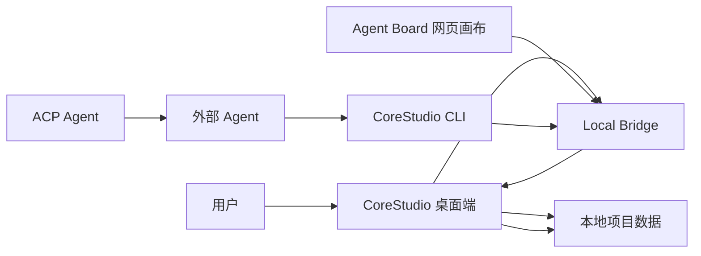
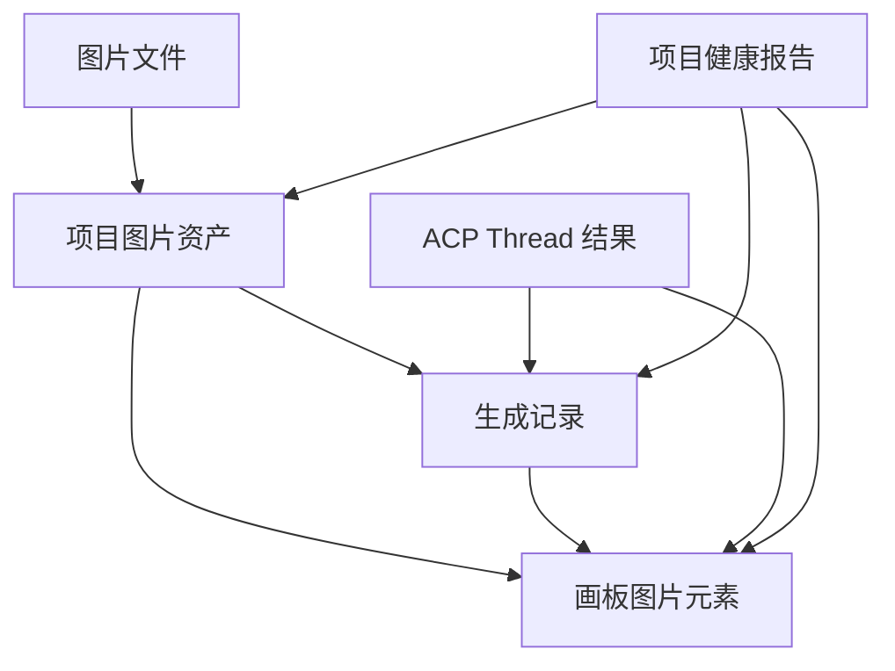

# Agent 集成架构与迭代原则

> 本文档沉淀本地网页画布、CLI 调用、ACP Agent 模式这一轮集成后的架构设计和经验。它不是执行计划；执行计划仍然看 [agent-integration-entry-map.md](./agent-integration-entry-map.md) 和 [agent-integration-v2-cleanup-plan.md](./agent-integration-v2-cleanup-plan.md)。

## 背景

最近几个版本把 CoreStudio 从一个本地 Excalidraw 画板，推进成一个可以和外部 Agent 协作的本地创作空间。

这轮新增了三条能力：

1. **本地网页画布。** 在 Codex、Cursor 或其他 Agent 内置浏览器里打开当前项目画板。
2. **CLI / Local Bridge 调用。** 让 Agent 读取项目、选区、图片原始路径、生成记录和健康报告，并通过受控命令写回。
3. **ACP Agent 模式。** 从 CoreStudio 内主动把复杂任务交给外部 Agent，并把过程、工具调用和结果带回项目。

这些能力不是三个互相独立的小功能，而是同一套本地 Agent 集成能力的三个入口。如果按入口各做一套状态、数据写入和 UI，就会很快出现下面这些问题：

- 右下角显示已连接，但网页画布显示未连接。
- 图片文件已经生成，但画板没有元素，生成记录也无法定位。
- ACP 任务已经完成，但用户只能看到调试日志，看不到可继续对话的 thread。
- 设置页、底部输入框、左侧栏、菜单、状态浮层都塞了类似但不一致的功能。
- `App.tsx`、`GenerateImageDialog.tsx`、`App.css` 变成新的业务堆积点。

所以这轮收口的核心不是“多做几个按钮”，而是重新确认架构边界：**CoreStudio 是数据 owner，Agent 是外部协作者，Local Bridge / CLI 是唯一受控写回路径。**

## 总体架构

这套结构里，每一层的职责要固定下来。

| 层级 | 职责 | 不做什么 |
| --- | --- | --- |
| CoreStudio 桌面端 | 项目数据 owner；维护画板、图片资产、生成记录、ACP thread、项目健康检查 | 不把自己变成内置 Agent 平台 |
| Local Bridge | 本机运行时底座；暴露项目 token、状态、读写命令入口 | 不绕开桌面端直接改项目文件 |
| CLI | 给 Agent 的稳定自动化接口；读状态、读图片路径、写图片结果、触发有限编辑动作 | 不保留一堆临时命令和隐藏捷径 |
| Agent Board | 在 Agent 内置浏览器里复用完整画板体验 | 不做脱离桌面端的独立 Web 应用 |
| ACP Agent | 从 CoreStudio 主动发任务给外部 Agent，并保存 thread / run log / 结果 | 不负责最终数据写回；写回仍走 CLI / Bridge |
| 项目健康检查 | 发现和修复资产、记录、画布、thread 之间的不一致 | 不只做缩略图修复 |

## 四条用户路径

目前产品心智应该分成四条路径，而不是只说“Agent 生成”。

| 路径 | 使用场景 | 是否连续上下文 | 主要结果 |
| --- | --- | --- | --- |
| 直接输入 | 单次 prompt 生图 | 否 | 生成记录、画布图片 |
| 网页画布 | 在 Agent 内置浏览器里看图、选图、标注、协作 | 取决于外部 Agent | 画布变化、生成记录 |
| CLI 调用 | Agent 自动读取项目和写回结果 | 由调用方管理 | 项目数据变化、结构化返回 |
| ACP Agent | CoreStudio 主动发起复杂任务给外部 Agent | 是，按 thread 管理 | Agent 对话、工具调用、图片结果、生成记录 |

这四条路径不能混在一个开关或一个“生成来源”里解释。直接输入是单次任务；ACP Agent 是连续任务；网页画布是远程可视化工作区；CLI 是机器可读写接口。

## 数据写回设计

Agent 集成里最重要的不是发起任务，而是写回数据时不把项目写坏。

一个完整的图片写回，至少要能解释这些对象之间的关系：

因此外部写入必须满足这些规则：

- 图片文件必须可读取。
- 来源不能为空；历史修复无法判断时可以用 `CoreStudio`，但不能留空。
- 生成记录可以没有 prompt，但不能没有可追踪的图片对象。
- 如果写入画板失败，不能只留下图片文件和半截记录。
- 如果 ACP 结果写回失败，thread 里要能看到失败原因，项目健康检查也要能发现断链。
- 重启开发版不能导致已生成资产或记录丢失。

这也是为什么项目健康检查和修复不应该再叫“缩略图修复”。它已经是项目数据一致性的守门员。

## 入口分工

这轮最大的产品经验是：入口散掉之后，用户会很快失去方向。

后续入口分工固定如下：

| 入口 | 应该承担 | 不应该承担 |
| --- | --- | --- |
| 应用设置 | Agent 总开关、ACP 配置、网页画布和 CLI 使用说明、高级调试入口 | 日常任务历史 |
| 右下角状态浮层 | 当前 Bridge / 项目 / Board / CLI / ACP 状态，以及复制快捷信息 | 配置表单、复杂任务列表 |
| 底部输入框 | 快速发起直接输入或 ACP Agent 任务 | 完整历史、原始 JSON、调试按钮 |
| 左侧栏 | 生成记录、ACP thread、继续对话、工具调用、图片结果定位 | 应用设置、协议调试 |
| 画布主菜单 | 当前项目、切换项目、Excalidraw 原生动作 | 项目维护、ACP 调试记录 |
| 桌面菜单 | 新建/打开/最近项目、项目维护、应用设置 | 画布内过程记录 |
| 高级调试 | ACP run log、任务包、协议 JSON、错误详情 | 默认暴露给普通用户 |

一个入口如果无法用一句话说清楚“它负责什么”，通常就说明它正在吸收不该吸收的功能。

## 架构分层

这轮重构后的方向是：主组件不再承载业务，业务判断下沉到 owner 模块。

推荐分层如下：

| 层级 | 典型文件 | 职责 |
| --- | --- | --- |
| Electron project services | `electron/project/projectHealth.ts`、`projectRepair.ts`、`projectImageRecords.ts` | 读写本地项目、检查和修复项目数据 |
| Electron Agent services | `electron/agent/localBridgeServer.ts`、`cliRuntime.ts`、`rendererCommandBridge.ts` | Local Bridge、CLI、renderer command 转发 |
| Shared contracts | `src/shared/agentBridgeTypes.ts`、`projectRecordIntegrity.ts` | 跨进程类型、写入完整性规则 |
| Renderer controllers | `src/app/agent/*Controller.ts`、`project/*Controller.ts` | 状态机、副作用编排、React setter 落点 |
| View model / state model | `agentIntegrationViewModel.ts`、`generationRecordViewModel.ts` | 把底层状态整理成 UI 可消费的数据 |
| UI components | `AgentConversationSidebar.tsx`、`GenerateImageDialog.tsx`、`AgentStatusDock.tsx` | 展示和用户交互，不直接解析协议 |
| Styles / tokens | `styles/designTokens.css`、feature CSS | 统一视觉语言，避免组件各自发明尺寸和字重 |

`App.tsx` 的目标不是“没有逻辑”，而是只保留应用级 wiring：把 bridge、当前项目、controller、组件挂起来。任何可以单独测试的业务规则，都不应该继续留在 `App.tsx`。

## 这轮踩过的坑

### 1. 先做入口，后补边界，会造成产品混乱

早期为了跑通功能，很多入口是边做边放的。结果是状态浮层、设置、输入框、左侧栏都有一点 Agent 能力，但每个地方都说不完整。

后续新增能力必须先回答：

- 这是配置、状态、发起、历史、项目动作，还是调试？
- 它应该出现在已有哪个入口？
- 它是否需要新增状态模型，而不是组件自己判断？

### 2. 写回链路不强校验，后面一定会变成修复功能买单

历史上出现过图片文件存在、生成记录缺失、画布元素缺失、记录无法定位的问题。根因不是“修复功能不够强”，而是写入时没有把完整关系一次性写对。

修复功能可以兜底历史数据，但不能替代新增数据的强校验。

### 3. Agent 对话不是调试日志

ACP 初期最容易把 run log 当成用户历史。但用户需要的是：

- Agent 说了什么。
- 调用了什么工具。
- 生成了什么图片。
- 结果在哪里。
- 能不能继续对话。

原始 JSON、task package、run log detail 应该留在高级调试里。

### 4. “生成来源”不如“任务模式”清楚

`内置生成 / Agent 生成` 容易让用户以为只是换一个模型来源。但实际区别更大：

- 直接输入是单次生成。
- ACP Agent 是复杂任务和连续对话。
- 网页画布操作是 Agent 在浏览器里介入画板。

所以后续界面应优先表达“任务模式”，再在必要位置解释具体执行来源。

### 5. 大文件不是风格问题，是架构问题

`App.tsx`、`GenerateImageDialog.tsx`、`App.css` 变大时，表面上只是不好读，实际上会带来三个风险：

- 状态 owner 不清楚，改 A 影响 B。
- UI 修样式时误伤运行逻辑。
- 测试只能测整棵树，无法稳定覆盖关键分支。

后续每个新能力都要顺手判断：是不是应该新增 controller、view model、project service、shared contract 或 component CSS。

### 6. 设计系统不是最后美化，而是开发约束

右下角按钮大小、浮层层级、侧边栏宽度、对话行距、工具调用卡片这些问题反复出现，说明样式不能靠当场感觉写。

以后新增 UI 要先找当前底座里最接近的模式，再落到 token 和组件规则里。尤其是：

- 字重不要随手写。
- 间距不要随手写。
- 按钮尺寸要和 Excalidraw / CoreStudio 现有控件对齐。
- 调试态和产品态不能共用一套视觉。

## 后续迭代原则

### 产品原则

1. **客户端优先。** CoreStudio 是本地客户端，Agent 集成不把它变成云端 Web 应用。
2. **Agent 是协作者，不是数据 owner。** Agent 可以看、读、请求写回，但最终写回由 CoreStudio 控制。
3. **入口少而清楚。** 能放进已有入口的，不新增入口；不能一句话说明职责的入口先不做。
4. **直接输入和 ACP Agent 要清楚区分。** 一个是单次生成，一个是连续任务。
5. **调试功能默认收起来。** 普通用户看结果和过程，高级调试看协议和 JSON。

### 架构原则

1. **所有外部写入走 CLI / Local Bridge。** 不允许 Agent 直接改项目文件。
2. **写入前后都要校验数据完整性。** 图片资产、画板元素、生成记录、thread 结果要互相可解释。
3. **`App.tsx` 只做应用级 wiring。** 新业务状态进 controller / hook / view model。
4. **Electron project layer 保持门面模式。** `projectFs.ts` 对外稳定，具体健康检查、修复、记录读写拆到 project service。
5. **UI 不解析协议。** ACP event、CLI result、health issue 先变成 view model，再给组件展示。
6. **测试跟着 owner 走。** 新 controller、state model、project service、contract 都要有独立测试。

### 体验原则

1. **画布能力尽量完整复用 Excalidraw。** Agent Board 不做功能收窄版画布，只收窄危险壳层和写回路径。
2. **侧边栏是历史和继续对话，不是调试面板。**
3. **状态浮层是监看和快捷入口，不是设置页。**
4. **项目健康报告要可解释。** 不只显示错误数量，还要说清楚对象、原因、影响和修复策略。
5. **生成记录必须能定位。** 定位不了就是数据一致性问题，而不是用户自己去找。

### 文档原则

1. 产品入口变化，要同步更新 [agent-integration-user-guide.md](./agent-integration-user-guide.md)。
2. CLI contract 变化，要同步更新 [agent-cli-contract.md](./agent-cli-contract.md)。
3. 架构边界变化，要同步更新本文档。
4. UI 规则变化，要同步更新 [agent-conversation-sidebar-reference.md](./agent-conversation-sidebar-reference.md) 或对应设计系统文档。
5. 修复过的典型问题，要进入 QA notes 或健康检查说明，而不是只留在聊天里。

## 新功能评审清单

以后做 Agent 相关功能，至少过一遍这个清单：

- 它属于网页画布、CLI、ACP Agent、直接输入，还是项目维护？
- 它的入口放在哪里？设置、状态浮层、底部输入框、左侧栏、菜单，还是高级调试？
- 它是否会写项目数据？如果会，是否走 CLI / Local Bridge？
- 它写入后，图片资产、画板元素、生成记录、thread 结果能否互相定位？
- 它失败后，用户看到的是产品错误，开发者是否还能看到调试详情？
- 它是否增加了新的状态 owner？owner 在哪里？
- 它是否需要健康检查或修复能力兜底？
- 它的样式是否复用现有 token、按钮尺寸、侧栏宽度和字重？
- 它有没有独立测试，而不是只靠手动点一下？

如果这几个问题答不上来，就先不要急着实现。
